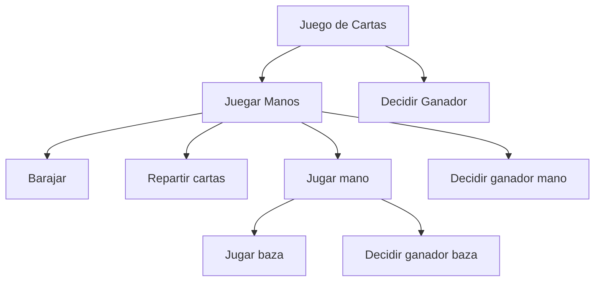

import Mermaid from "@components/Mermaid.astro";
import { ShowcaseProfile } from 'starlight-showcases';

El **Diseño Software** es clave en la **Ingeniería del Software**, donde se aplican enfoques sistemáticos para el desarrollo, operación y mantenimiento del software.

## Modelado (Diseño)

- Un modelo (aka. diseño) simplifica la realidad para entender sistemas complejos.
- Principios básicos del modelado:
  - Elegir modelos adecuados influye en la solución.
  - Los mejores modelos están ligados a la realidad.
  - Es mejor usar múltiples modelos casi independientes.

### Analogía con la arquitectura

- **Caseta de perro**: proceso simple y modelado mínimo.
- **Casa**: modelado elaborado y proceso bien definido.
- **Rascacielos**: modelado complejo con herramientas sofisticadas.

Dependiendo el fin debemos tomar un enfoque más o menos elaborado. Los diseños de software son dinámicos y evolucionan constantemente, a diferencia de las limitaciones físicas en arquitectura.

### Objetivos del diseño

- **Modelo estático**: Representa la estructura del programa en base a paquetes y objetos que se relacionan.
- **Modelo dinámico**: Representa el comportamiento del programa en base a objetos que se comunican entre sí.

## 2. Ingeniería del Software

_fuente: [http://xkcd.com/844/](http://xkcd.com/844/)_

### Modelos de desarrollo:

- **Modelo en cascada**: fases secuenciales (requisitos, diseño, codificación, prueba, mantenimiento).
- **Proceso Unificado**: iterativo e incremental, con fases (inicio, elaboración, construcción, transición).

## 3. La programación orientada a objetos (POO):

- **Encapsulación**, **modularidad**, **abstracción**, **herencia** y **polimorfismo**.
- Ventajas:
  - **Reutilización** de componentes.
  - **Modularidad** para un diseño más claro.
  - Mejor **escalabilidad** y extensibilidad.
- Inconvenientes:
  - Curva de aprendizaje alta.
  - Cambiar de enfoques top-down a bottom-up.
  - Requiere esfuerzo consciente para lograr reutilización efectiva.

### Diseño Top-Down vs. Bottom-Up

- **Top-Down**: descomposición jerárquica, difícil reutilización.

<Mermaid>

</Mermaid>

- **Bottom-Up**: énfasis en objetos autosuficientes y reutilizables. **(Es el modelo de diseño de la orientación a Objetos)**

## 4. Modelo Conceptual del Dominio

- Se centra en representar clases, atributos y relaciones del mundo real.
- Las asociaciones son relaciones semánticas entre objetos.

## 5. Asignación de Responsabilidades

- Consiste en asignar contratos u obligaciones a objetos para realizar tareas.
- Tipos de responsabilidades:
  - **Hacer**: acciones como crear objetos o coordinar actividades.
  - **Conocer**: acceso a datos internos o relacionados.

## 6. Ventajas e Inconvenientes de la POO

### Ventajas:

- **Naturalidad**: modela el mundo real.
- **Extensibilidad**: la herencia permite modularidad progresiva.
- **Escalabilidad**: diseños extensibles para proyectos grandes.

### Inconvenientes:

- Complejidad inicial.
- Enfoques inapropiados pueden llevar a diseños ineficientes.

<ShowcaseProfile
  entries={[
    {
      name: 'Pablo Portas López',
      picture: 'https://avatars.githubusercontent.com/u/81629707?v=4',
      href: 'https://github.com/TeenBiscuits',
      description:
        "© 2025 licensed under CC BY-NC 4.0",
    },
  ]}
/>
