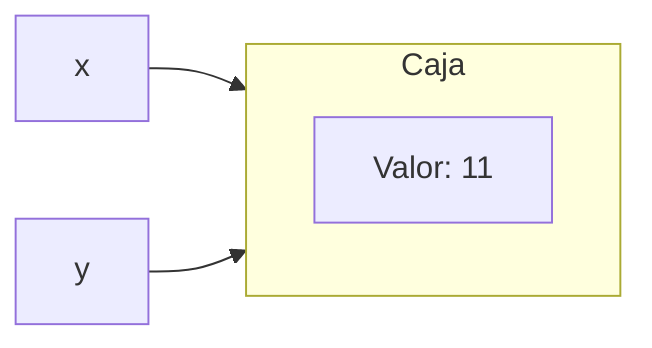
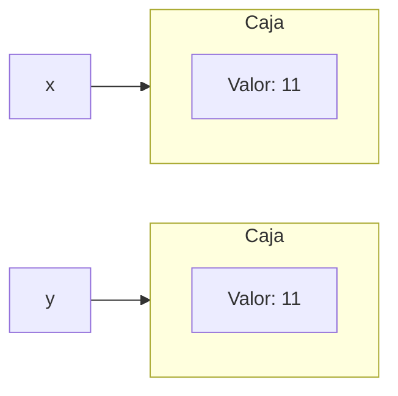
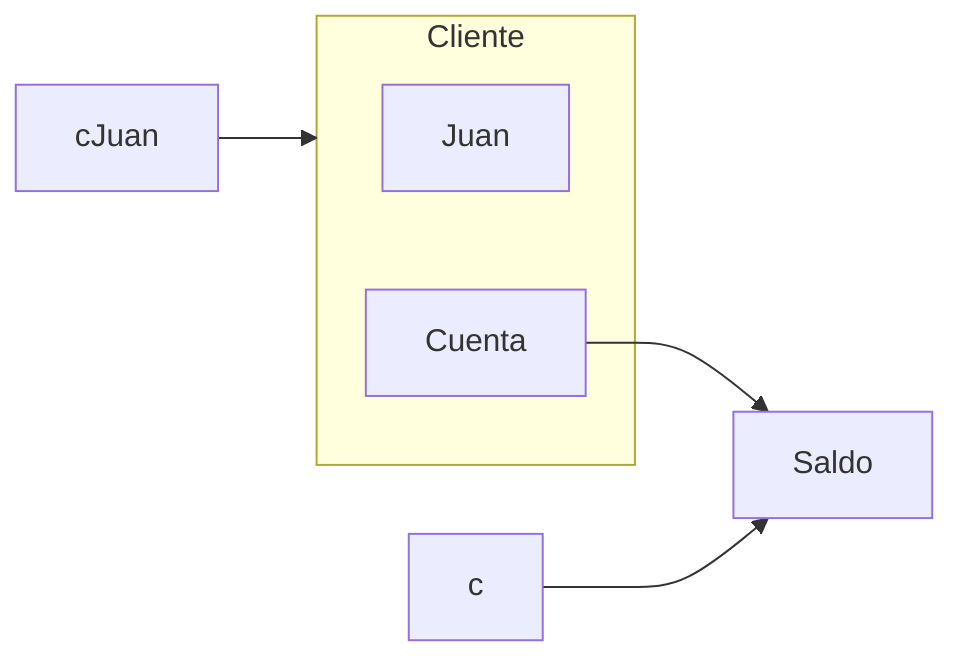
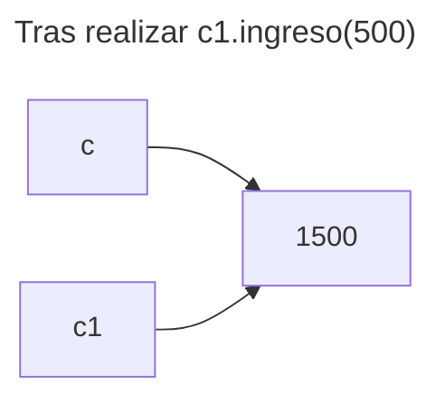
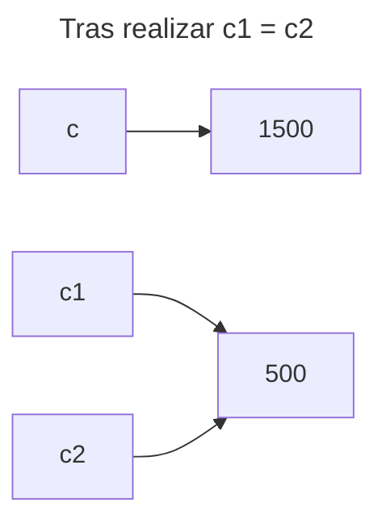

import Mermaid from "@components/Mermaid.astro";
import { ShowcaseProfile } from 'starlight-showcases';

Análisis de los elementos fundamentales de la orientación a objetos, incluyendo clases, objetos, identidad, estado y comportamiento, con un enfoque práctico en la implementación en Java mediante el uso de atributos, métodos y constructores.

## 1. Clases y Objetos

### Definición de clase


:::note
La definición de Progamación Orientado a Objetos no incluye clases (pero prácticamente todos los lenguajes orientados a objetos tienen clases):
> Se compone de objetos que se comunican entre sí intercambiando mensajes.
:::

Una clase es una _plantilla_ que describe la **estructura** y el **comportamiento** de un
tipo de objeto y permite la **creación** de los mismos.

```java
[Modificadores] class Nombre [extends clase] [implements interfaz, ...] { 
    // Atributos // Métodos 
}
```

- **Modificadores**:
    - ``public``: Permite que la clase sea accesible desde otro paquete (no confundir con los especificadores de visibilidad de atributos).
    - ``abstract``: Define clases que no pueden instanciarse.
    - ``final``: Define clases que no pueden extenderse con subclases.
- **Cláusula ``extends``**:
    - Define la superclase de la clase actual (por defecto Object).
- **Cláusula ``implements``**:
    - Define los interfaces que implementa la clase.

Los elementos ``abstract``, ``final``, ``extends`` e ``implements`` se explican en el [Tema 3](/deese/apuntes/t3-propiedades_basicas/).

A lo largo del tema se utilizará esta clase ``Caja`` como ejemplo.

```java title="Caja.java"
public class Caja {
    // Atributos - Estado
    private int valor;
    
    // Métodos - Comportamiento
    public void setValor (int v) {
        valor = v;
    }
    public int getValor () {
        return valor;
    }

    // Constructores
    public Caja() {
        valor = 0;
    }
    public Caja(int v) {
        valor = v;
    }
}
```

### Definición de objeto


Elemento **identificable** que contiene **características declarativas** (que determinan su estado) y **características procedimentales** (que modelan su comportamiento).

```java
[Clase] Nombre = new Constructor();
```

Para crear un objeto se usa el operador `new` junto con el constructor (`Constructor()`) de la clase (`[Clase]`).

```java
Caja x = new Caja();  // Un objeto 'x' de clase 'Caja' con 'valor = O'
Caja y = new Caja(5); // Un objeto 'y' de clase 'Caja' con 'valor = 5'
Caja z = new Caja(5); // Un objeto 'z' de clase 'Caja' con 'valor = 5'
```

:::caution

**Todos** los objetos son **PUNTEROS**. Por ejemplo los objetos `y` y `z` pueden parecer _iguales_ pero **NO** són **idénticos**. Són punteros que apuntan a direcciones de memoria **distintas**, que en su interior contienen **valores iguales**. Más sobre esto en [el bloque siguiente](#2-identidad-de-objetos).

No te preocupes, en Java (al contrario que en C), no andaremos jugando ni rompiendo la cabeza con punteros. Pero debes tener en cuenta siempre esta equivalencia.

:::

:::tip

Si quieres comprobar lo aprendido añade a tu clase `Caja` un método `main`, esto te permitirá ejecutarlo y comprobar directamente desde tu editor el resultado.

```java title="Caja.java" collapse={2-20} ins={22-32}
public class Caja {
    // Atributos - Estado
    private int valor;
    
    // Métodos - Comportamiento
    public void setValor (int v) {
        valor = v;
    }
    public int getValor () {
        return valor;
    }

    // Constructores
    public Caja() {
        valor = 0;
    }
    public Caja(int v) {
        valor = v;
    }


    public static void main(String[] args) {
        Caja x = new Caja();
        Caja y = new Caja(5);
        Caja z = new Caja(5);
        System.out.println("x.getValor(): " + x.getValor());
        System.out.println("y.getValor(): " + y.getValor());
        System.out.println("z.getValor(): " + z.getValor());
        System.out.println("x = x: " + (x == x));
        System.out.println("x = y: " + (x == y));
        System.out.println("y = z: " + (y == z));
    }

}
```
```txt title="Salida por pantalla" frame="terminal" {"Recuerda: Son punteros":6-7}
x.getValor(): 0
y.getValor(): 5
z.getValor(): 5
x = x: true
x = y: false

y = z: false
```

:::

## 2. Identidad de Objetos

La identidad es la propiedad de un objeto que lo distingue de todos los demás de forma independiente al valor de sus atributos.

### Identidad vs. Igualdad

**Identidad**: Dos objetos son idénticos si y solo si son el mismo objeto (es decir, tienen un mismo OID).

> Comparación de identidad: mediante el operador `==`.

```java
Caja x = new Caja();
x.setValor(7);
Caja y = x;
y.setValor(11);
```

<Mermaid>

</Mermaid>

**Igualdad**: Dos objetos se consideran iguales si, a pesar de ser objetos distintos (con distinto OID), sus atributos son idénticos.

> Comparación de igualdad: mediante el método `equals`.

```java
Caja x = new Caja();
x.setValor(11);
Caja y = new Caja();
y.setValor(11);
```

<Mermaid>

</Mermaid>

:::caution

Si `equals` no ha sido definido en la clase (`Caja`) se utiliza _por defecto_: el de la **superclase** `Object` que equivale a hacer `==`.

```java {6-7}
public static void main(String[] args) {
    Caja x = new Caja();
    x.setValor(11);
    Caja y = new Caja();
    y.setValor(11);
    System.out.println(x == y);      // Resultado esperado: false
    System.out.println(x.equals(y)); // Resultado esperado: true
}
```
```txt frame="terminal" title="Salida por pantalla"
false
false
```
¿Como solucionamos esto? **Sobrescribiendo** el método `equals`. Veámoslo en el [siguiente apartado](#equals).
:::

### Equals

Para crear un método equals correcto debemos cumplir el siguiente contrato:

- **Reflexividad**: ``x.equals(x)`` debe devolver true.
- **Simetría**: ``x.equals(y)`` debe devolver lo mismo que ``y.equals(x)``.
- **Transitividad**: Si ``x.equals(y)`` devuelve true y ``y.equals(z)`` devuelve true entonces ``x.equals(z)`` debe devolver ``true``.
- **Consistencia**: Si no se modifica el estado de los objetos que se usa para la comparación repetidas llamadas a ``x.equals(y)`` deberían responder siempre lo mismo.
- **Uso de nulos**: ``x.equals(null)`` debe devolver ``false`` para cualquier valor x no nulo.

Vamos a **redefinir** mediante `@Override` (`this` es el objeto que realiza la comparación): 

```java title="Caja.java" collapse={2-20,38-47} {"Si los objetos son idénticos entonces son iguales.":23-24} {"Si obj es nulo la comparación es falsa.":26-27} {"Si la clase de obj no es igual a la clase actual (Caja) la comparación es falsa.":29-32} {"Si la clase de obj no es igual a la clase actual (Caja) la comparación es falsa.":34-36}
public class Caja {
    // Atributos - Estado
    private int valor;

    // Métodos - Comportamiento
    public void setValor(int v) {
        valor = v;
    }
    public int getValor() {
        return valor;
    }

    // Constructores
    public Caja() {
        valor = 0;
    }
    public Caja(int v) {
        valor = v;
    }

    @Override
    public boolean equals(Object obj) {

        if (this == obj) { return true; }


        if (obj == null) { return false; }


        if (getClass() != obj.getClass()) {
            return false;
        }


        Caja caja = (Caja) obj;
        return this.valor == caja.valor;
    }

    public static void main(String[] args) {
        Caja x = new Caja();
        x.setValor(11);
        Caja y = new Caja();
        y.setValor(11);
        System.out.println(x == y);      // Resultado esperado: false
        System.out.println(x.equals(y)); // Resultado esperado: true
    }

}
```

:::tip

Puedes copiar y pegar el código anterior en tu editor y comprobar que funciona ejecutando el `main`. **Usa el botón de la esquina superior derecha.**

:::

### hashCode

> Es una función que mapea datos de un tamaño arbitrario en datos de un tamaño fijo.

:::note

La letra del DNI sería un ejemplo de una función hash usada para implementar un checksum. [Wikipedia](https://es.wikipedia.org/wiki/Documento_nacional_de_identidad_(Espa%C3%B1a)#N%C3%BAmero)

:::

Si dos objetos son **iguales**, de acuerdo con el método `equals(Object)`, entonces llamar al método `hashCode()` sobre ambos objetos debe producir **el mismo resultado**.

:::caution

Por defecto `hashCode()` devuelve la **dirección de memoria del objeto**. Por lo tanto debemos redefinir `hashCode` y `equals` para que funcionen de forma **coordinada**. 

:::

A partir de Java 7 existe un método en `Objects` llamado `hash()`, capaz de calcular de forma consistente valores _hashcode_ con los datos que le pasemos.

En el siguiente ejemplo, acordamos que dos Cajas Extendidas serán iguales, si y solo si, **todas sus variables internas son iguales**. Por lo tanto redefinimos tanto `equals` como `hashCode`.

```java title="CajaExtendida.java" collapse={10-15} {"Para comparar Strings se utiliza equals":21-22}
public class CajaExtendida {
    private int valorEntero;
    private char valorChar;
    private double valorDouble;
    private boolean valorBoolean;
    private String valorString;

    @Override
    public boolean equals(Object obj) {
        if (this == obj) { return true; }
        if (obj == null) { return false; }
        if (getClass() != obj.getClass()) {
            return false;
        }

        CajaExtendida caja = (CajaExtendida) obj;
        return (this.valorEntero == caja.valorEntero)
                && (this.valorChar == caja.valorChar)
                && (this.valorDouble == caja.valorDouble)
                && (this.valorBoolean == caja.valorBoolean)

                && (Objects.equals(this.valorString, caja.valorString));
    }

    @Override
    public int hashCode() {
        return Objects.hash(valorEntero, valorChar, valorDouble,
                valorBoolean, valorString);
    }
}
```


:::tip

Puedes añadir a la clase **`Caja`** que hemos estado usando de ejemplo hasta ahora este método para utilizar `hashCode()`: 

```java title="Caja.java" ins={1-4}
@Override
public int hashCode() {
    return Objects.hash(valor);
}
```

:::

:::note

En Java `hashCode()` fue implementado usando _hash 31_. [Wikipedia](https://es.wikipedia.org/wiki/HashCode()_(Java))

:::

## 3. Estado de Objetos

### Definición de Atributos

```java
[EspecificadorAcceso][Modificadores] tipo nombreAtributo [= valorInicial];
```

- **Especificador de Acceso**: Definen desde dónde podemos acceder a ese atributo.
- **Modificadores**: Permiten definir atributos de clase y atributos constantes.
- **Valor inicial**:
    - Todos los atributos se inicializan automáticamente al valor cero (si es numérico), false (si es booleano) o null (si es un objeto).
    - En la definición se puede definir, si se considera necesario, un valor inicial distinto a dicho atributo.

### Especificadores de Acceso

- **Público (`public`)**: Los atributos son visibles para todas las clases.
- **Paquete (no se indica especificador)**
    - Es el que se aplica si no se especifica ningún especificador
    - Permite que el atributo sea visible a todas las clases que se sitúan en el mismo paquete que la clase original.
- **Protegido (`protected`)**
    - Permite que el atributo sea visible a las subclases de la clase original
    - También permite el acceso a las clases que se encuentren en el mismo paquete (a diferencia de otros leng. de programación).
- **Privado (`private`)**: Los atributos sólo son visibles dentro de la propia clase.


\* En `protected` se puede acceder desde una subclase (otro paquete) solo desde objetos declarados del tipo de la **subclase** no de la superclase.

**¿Porque fue diseñado así?** Probablemente para hacerlos contenidos unos en otros. Lo cual provoca que la visibilidad "protegida" sea la más permisiva después de "pública".


**Ortodoxia de la Orientación a Objetos**: Los atributos deben declararse privados y su acceso sólo debe ser posible a través de métodos públicos de lectura/escritura.

```java
class Clase {
    private int valor; // La propiedad se define privada

    public int getValor() { // Método de lectura
        return valor;
    }
        
    public void setValor(int valor) { // Método de escritura
        this.valor=valor;
    }
}
```

#### Acceso a objetos privados mutables

Se crea una clase Cuenta, para guardar y interactuar con una cuenta bancaria.

- Se define un atributo `balance` de tipo primitivo `int` y `privado`. Por lo tanto no es accesible desde fuera de su clase
- Se define un constructor y métodos de lectura y escritura para modificar el balance.

```java title="Cuenta.java"
class Cuenta {
    // Atributos
    private int balance = 0;

    // Métodos constructores
    public Cuenta(int cantidad) {
        balance = cantidad;
    }

    // Métodos de lectura y escritura
    public int getBalance() {
        return balance;
    }
    public void retirada(int cantidad) {
        balance = balance - cantidad;
    }
    public void ingreso(int cantidad) {
        balance = balance + cantidad;
    }
}
```

- La clase `Cliente` se define con dos atributos privados, uno de ellos de tipo `Cuenta`.

- Definimos un constructor y métodos de lectura pero no permitimos el acceso al atributo privado de tipo `Cuenta` desde fuera de esos métodos.

```java title="Cliente.java"
class Cliente {
    // Atributos
    private String nombre;
    private Cuenta cuenta;

    // Métodos constructores
    public Cliente(String n, int c) {
        nombre = n;
        cuenta = new Cuenta(c);
    }

    // Métodos de acceso
    public String getNombre() {
        return nombre;
    }
    public Cuenta getCuenta() {
        return cuenta;
    }
}
```

:::caution

Si devolvemos referencias a objetos privados mutables (que pueden modificarse después de haber sido creados), el contenido de dichos objetos puede ser modificado desde fuera de la clase en la que residen.

```java
Cliente cJuan = new Cliente ("Juan", 1000); // Cliente con mil euros
Cuenta c = cJuan.getCuenta(); // Obtenemos referencia a objeto privado
c.retirada (1000); // Como el objeto es mutable lo modificamos
// Juan se queda compuesto y sin mil euros
System.out.println("Saldo de Juan = " + cJuan.getCuenta().getBalance());
```
```txt frame="terminal" title="Salida por pantalla"
Saldo de Juan = 0
```
<Mermaid>

</Mermaid>
Dos soluciones: **Uso de clones** o **Objetos inmutables**.
:::

```java title="Uso de clones" frame="terminal" collapse={2-4,14-26,30-44} del={46} ins={"Crea una cuenta nueva a partir de otra":9-13} ins={"Ya no devuelve su propia cuenta sino un clon de la misma":47-48}
class Cuenta {
    // Atributos
    private int balance = 0;

    // Métodos constructor
    public Cuenta(int cantidad) {
        balance = cantidad;
    }

    // Método constructor de copia
    public Cuenta (Cuenta c) {
        this.balance = c.balance;
    }

    // Métodos de lectura y escritura
    public int getBalance() {
        return balance;
    }

    public void retirada(int cantidad) {
        balance = balance - cantidad;
    }

    public void ingreso(int cantidad) {
        balance = balance + cantidad;
    }
}

class Cliente {
    // Atributos
    private String nombre;
    private Cuenta cuenta;

    // Métodos constructores
    public Cliente(String n, int c) {
        nombre = n;
        cuenta = new Cuenta(c);
    }

    // Métodos de acceso
    public String getNombre() {
        return nombre;
    }

    public Cuenta getCuenta() {
        return cuenta;

        return new Cuenta (cuenta);
    }
}
```

```java title="Objetos inmutables" frame="terminal" del={"Sin métodos de escritura no hay modificación posible":14-20}
class Cuenta {
    // Atributos
    private int balance = 0;

    // Métodos constructores
    public Cuenta(int cantidad) {
        balance = cantidad;
    }

    // Métodos de lectura y escritura
    public int getBalance() {
        return balance;
    }

    public void retirada(int cantidad) {
        balance = balance - cantidad;
    }
    public void ingreso(int cantidad) {
        balance = balance + cantidad;
    }
}
```

### Modificadores de Atributos

- **`static`**:
    - Los atributos pertenecen **a la clase** y no a una instancia en particular.
    - **Pueden ser modificados** sin que exista una instancia creada de la clase.
    ```java title="Persona.java" {"Acceder mediante la clase":6-7} {"O mediante un objeto de esa clase":8-9}
    public class Persona {
        public int edad;
        public static int edadVoto = 18;
        public static void main (String[] args) {
            Persona p1 = new Persona();

            System.out.println("Edad de voto = " + Persona.edadVoto);
            
            System.out.println("Edad de voto = " + p1.edadVoto);
        }
    }
    ```
- **`final`**:
    - Atributos **constantes**.
    - Una vez que le hemos asignado un valor **no es posible cambiarlo**.
    ```java title="Constante de clase" frame="terminal" {"PI es una constante, es static y final":3-4}
    public class Circulo {
        public int radio;

        public static final double PI = 3.1416;
        public Circulo(int r) {
            radio = r;
        }
        public double areaCirculo() {
            return PI * radio * radio;
        }
    }
    ```
    ```java title="Blank Finals (constantes de instancia)" frame="terminal" {"Cada persona tiene un DNI diferente por eso no es static":7-8}
    public class Persona {
        // Definimos la constante, pero no le damos valor
        public final String DNI;

        // El valor debe asignarse en el constructor
        public Persona(String identificador) {
            
            DNI = identificador;
        }
    }
    ```
- **Otros atributos**:
    - `transient` o `volatile` son particulares de Java y menos usados.

## 4. Comportamiento de Objetos

### Definición de Métodos

```java
[EspecificadorAcceso][Modificadores] tipoRetorno nombreMetodo ([parametro1, parametro2, ...]) { cuerpoMetodo }
```

- **Especificadores de Acesso**: Iguales que los atributos
- **Modificadores**: Permiten definir métodos de clase (``static``), métodos diseñados para ser sobrescritos (``abstract``), métodos que no pueden sobrescribirse (``final``), etc.

:::caution

En Java **todos los parámetros** se pasan por valor. Es decir el valor de los parámetros se **copia** al parámetro formal.

Ya que los objetos son punteros, una copia de una dirección de memoria **sigue apuntando al mismo sitio que el objeto original**. 

Un ejercicio para ver este comportamiento es este:

```java title="¿Cuál es el resultado de este código?" frame="terminal"
public class Parametros {
    public static void manipularCuenta(Cuenta c1) {
        c1.ingreso(500);
        Cuenta c2 = new Cuenta(500);
        c1 = c2;
    }
    public static void main(String[] args) {
        Cuenta c = new Cuenta(1000);
        manipularCuenta(c);
        System.out.println("Saldo = " + c.getBalance());
    }
}
```
<details>
<summary>Mostrar Solución</summary>
```txt title="Salida por pantalla" frame="terminal"
Saldo = 1500
```
<Mermaid>

</Mermaid>
<Mermaid>

</Mermaid>
</details>

Poner `final` en `public static void manipularCuenta(final Cuenta c1)` **no es una solución** al problema, solo provoca un **error de compilación** en `c1 = c2`

:::

En Java los atributos _ensombrecen_ a los atributos dentro de los métodos. Para evitar conflictos se emplea el puntero `this`:

```java
public class Parametros {
    private int valor;
    public void setValor(int valor) {
        this.valor = valor;
    }
}
```

### Modificadores de Métodos

- **``static``**: Métodos de clase.
- **``abstract``**:
    - Métodos no definidos destinados a ser implementados por una subclase.
    - Se tratarán con más detalle al hablar de la herencia: [Tema 3](/deese/apuntes/t3-propiedades_basicas/).
- **``final``**:
    - Evita que un método sea sobreescrito
    - Si una clase es final todos sus métodos son implícitamente final.
    - Se tratarán con ms ádetalle al hablar del polimorfismo: [Tema 3](/deese/apuntes/t3-propiedades_basicas/).

#### Métodos de clase (`static`)

Són útiles cuando no se necesita acceder a al estado del objetos. Un ejemplo es en la API de Java, en la libería `Math` el método `max`.

```java "static"
// API de Java
public class Math {
    public static int max(int a, int b) { /* ... */ }
    // ...
}
// Nuestro código
System.out.println("El mayor de " + a + " y " + b + ": " + Math.max(a,b));
```

:::caution

En los métodos estáticos no se puede usar el puntero `this`.

:::

### Métodos Constructores

> Son los métodos que se utilizan para crear e inicializar instancias.

```java title="Caja.java" {5-8}
public class Caja {
    private int valor;
    public void setValor(int v) {valor = v;}
    public int getValor() { return valor; }
    // Método constructor
    public Caja(int valor) {
        this.valor = valor;
    }
    public static void main(String[] args) {
        Caja c = new Caja(5);
        System.out.println("Valor = " + c.getValor());
    }
}
```

En la creación de un objeto hay dos fases diferentes:

- `new`: Creación del objeto en el montículo.
- `Caja(5)`: Inicialización del objeto usando un constructor.

```java
Caja c = new Caja(5);
```

:::note

Si se utiliza un constructor `Caja()` **sin tener ningún constructor definido**. Lo que hará es inicializar los estados **a cero**.

```java
Caja c = new Caja(); // valor = 0
```

:::

#### ¿Tiene sentido utilizar constructores `private`?

**Pues si**. Un constructor privado permite controlar la creación de instancias. **Nadie podrá crear objetos usando ``new``**, fuera de tu clase.

Tiene utilidad a la hora de usar distintos patrones como [enumerados](#tipos-de-enumerados), singleton, etc.

### Tipos de Enumerados

> Es un tipo de datos que consiste en un conjunto de valores con nombre llamados elementos que se comportan como constantes en el lenguaje.

:::note

Antiguamente los enumerados en java eran creados de la siguiente manera:

```java title="Calificaciones.java" collapse={8-9,12-14} {"Todas estas llamadas al constructor son válidas":15-19}
public class Calificacion {
    public static final int MATRICULA = 4;
    public static final int SOBRESALIENTE = 3;
    public static final int NOTABLE = 2;
    public static final int APROBADO = 1;
    public static final int SUSPENSO = 0;
    public static final int NO_PRESENTADO = -1;


    // El tipo del parámetro no aclara el objetivo
    public static void introduceCalificacion(int calificacion) { /* ... */ }

    public static void main(String[] args) {


        Calificacion.introduceCalificacion(Calificacion.MATRICULA);
        Calificacion.introduceCalificacion(Calificacion.APROBADO);
        Calificacion.introduceCalificacion(257); // WTF
        Calificacion.introduceCalificacion(7);
    }
}
```

Como se puede observar los enumerados pueden ser fuente de errores. Para evitar esto se creó [el patrón de diseño](/deese/apuntes/t6-patrones_diseno/): **Enumerados de Tipos Seguros (TypeSafe Enum)**.

Existen varias formas de aplicarlo, como el siguiente código de ejemplo, pero la forma más sencilla es emplear `enum`.

```java title="Calificaciones.java" collapse={9-10,13-14} ins={2-8} ins={12} del={"Esta linea ahora no compila":17-18}
public class Calificacion {
    private Calificacion() {}; // Constructor definido privado
    public static final Calificacion MATRICULA = new Calificacion();
    public static final Calificacion SOBRESALIENTE = new Calificacion();
    public static final Calificacion NOTABLE = new Calificacion();
    public static final Calificacion APROBADO = new Calificacion();
    public static final Calificacion SUSPENSO = new Calificacion();
    public static final Calificacion NO_PRESENTADO = new Calificacion();


    // El tipo del parámetro no aclara el objetivo
    public static void introduceCalificacion(Calificacion c) { /* ... */ }

    public static void main(String[] args) {
        Calificacion.introduceCalificacion(Calificacion.MATRICULA);
        Calificacion.introduceCalificacion(Calificacion.APROBADO);
        
        Calificacion.introduceCalificacion(257); // WTF
        Calificacion.introduceCalificacion(7);
    }
}
```

:::

Podemos simplificar el enum (Cumpliendo el TypeSafe enum) de la siguiente manera.

```java title="Calificacion.java"
enum Calificacion {
    MATRICULA(10),
    SOBRESALIENTE(9),
    NOTABLE(7),
    APROBADO(5),
    SUSPENSO(0),
    NO_PRESENTADO(0);

    private int valor;
    public int getValor() { return valor; }
    
    Calificacion(int valor) { this.valor = valor; }
}
```

:::tip

Puedes hacer comparaciones entre enumerados con `==`, `equals` o `CompareTo`.

Puedes recorrer todos los elementos del enumerado utilizando el método `values`:

```java
for (Calificacion cc : Calificacion.values()) {
    System.out.println(cc)// Por ejemplo imprimir por pantalla
}
```

Puedes obtener el nombre del elemento con un `toString`. También puedes extraer su valor ordinal mediante `ordinal` o utilizando el nombre del elemento con `valueOf`.

```java
Calificacion.NOTABLE.toString(); // "NOTABLE"
Calificacion.valueOf("NOTABLE"); // 7
Calificacion.NOTABLE.ordinal();  // 7
```

:::

### Registros

> Un registro es un tipo de clase restringida que se crea de forma sencilla y eficiente para actuar como portadora de datos.

Los registros añaden automáticamente automáticamente varios métodos:

```java title="Registros en Java" frame="terminal"
public record Caja(int valor) { }
// ...
public class UsaCaja {
    public static void main(String[] args) {
        Caja c1 = new Caja(5); // llamadas al constructor canónico
        Caja c2 = new Caja(5);
        System.out.println(c1.valor()); // llamada a "valor()"
        System.out.println(c1); // llamada a "toString()"
        System.out.println(c1.equals(c2)); // llamada a "equals(...)"
        // También se implementan los métodos equals y hashCode
    }
}
```

#### Registros y constructores

Podemos modificar **el constructor canónico** mediante el **constructor compacto** (obtienes los parámetros de la declaración del registro, en este caso solamente `valor`).

Podemos añadir otros constructores pero tendremos que hacer **obligatoriamente** referencia al canónico.

```java title="Registro.java" del={"Devolverá un error en tiempo de ejecución":12-13}
public record Registro(int valor) {
    public Registro { // Constructor compacto
        if (valor < 0) // Cambia el constructor canónico
            throw new IllegalArgumentException();
    }
    public Registro(String numero) {
        this(Integer.decode(numero)); // Llamada al constructor canónico
    }
    public static void main(String[] args) {
        Registro r1 = new Registro("1");
        System.out.println("r1 = " + r1); // r1 = Registro[valor=1]
        
        Registro r2 = new Registro(-3); // throws IllegalArgumentException
    }
}
```

#### Registros y métodos

Es posible añadir a los registros **atributos estáticos** (no de instancia) y **métodos de instancia o estáticos** si fuera necesario. También podemos darle una **nueva implementación** a los métodos de lectura y/o escritura.

```java title="Registro.java" {"Atributo estático":2-3} {"Método de instancia":4-5} {"Método estático":6-7} {"Reimplementación del método de lectura del atributo":8-9}
public record Registro(int valor) {

    public static final int sentidoVida = 69;
    
    public int valorAlCuadrado() { return valor * valor; }
    
    public static int getSentidoVida() { return sentidoVida; }
    
    public int valor() { return valor * 2; }
    public static void main(String[] args) {
        Registro c = new Registro(5);
        System.out.println(r.valorAlCuadrado()); // 25
        System.out.println(Registro.getSentidoVida()); // 69
        System.out.println(r.valor()); // 10
    }
}
```

<ShowcaseProfile
  entries={[
    {
      name: 'Pablo Portas López',
      picture: 'https://avatars.githubusercontent.com/u/81629707?v=4',
      href: 'https://github.com/TeenBiscuits',
      description:
        "© 2025 licensed under CC BY-NC 4.0",
    },
  ]}
/>