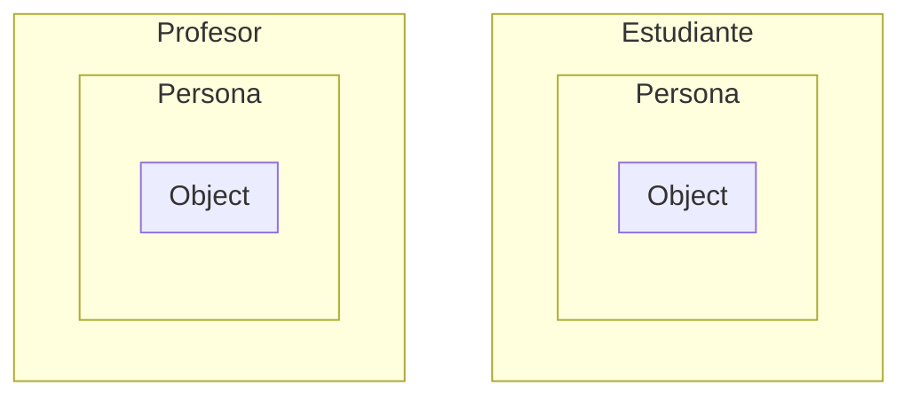
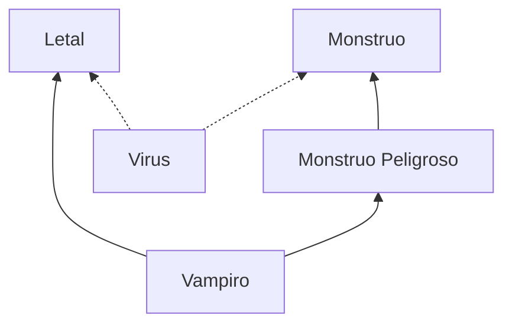
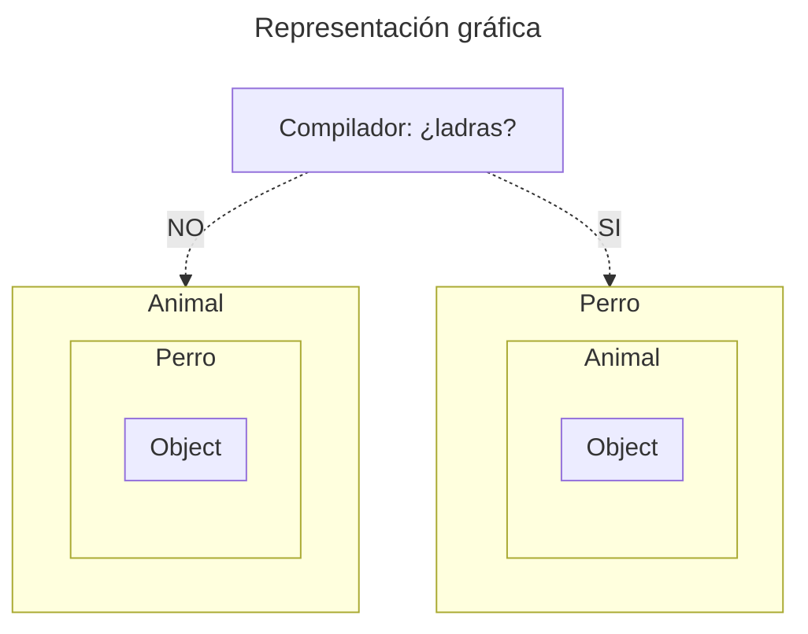

import Mermaid from "@components/Mermaid.astro";
import { ShowcaseProfile } from 'starlight-showcases';
import { FileTree, LinkButton } from '@astrojs/starlight/components';

Aprende sobre conceptos clave como abstracción, encapsulamiento, modularidad, jerarquía, polimorfismo, tipificación y ligadura dinámica.

## 1. Modularidad

> Propiedad que tiene un sistema que ha sido descompuesto en un conjunto de partes o módulos que sean cohesivos (guardan cierta relación lógica) y débilmente acoplados (minimizan sus dependencias).


Durante este bloque utilizaremos este proyecto de ejemplo creado en el IDE InteliJ. Poco a poco iremos desglosando como funciona Java y la programación Orientada a Objetos.

<FileTree>

- .idea/ directorio del IDE _(podemos ignorarlo)_
- out/ los archivos de compilación _(resultado de compilar tu código)_
- src/ nuestro código fuente
    - graficos/
        - Circulo.java
        - ...
    - otropaquete/
        - Dibujante.java
        - ...
- test/ nuestros tests _(no se verá en este tema)_
- .gitignore

</FileTree>

:::note

_En el IDE, el icono de los archivos ``.java`` varía según la clase. El símbolo de las tazas de café esta licenciado por la compañía Oracle por eso una letra J._

:::

- Un **paquete** es $$=$$ a un **directorio**
    - Es una agrupación lógica de clases.
    - Las clases públicas son solo visibles dentro del paquete.
- Un **fichero** $$\neq$$ a una **clase**
    - Dentro de un fichero puede haber **más de una clase**, pero **solo una clase pública** y esa fichero tiene que llamarse igual que la clase. `public class Circulo` en `Circulo.java`.

```java title="Circulo.java"
package graficos;

public class Circulo {
    private int radio;

    public int getRadio() { return radio; }

    public void setRadio(int radio) {
        this.radio = radio;
    }
    //...
}
```

Para importar el paquete y poder usar las clases de otro paquete empleamos `import graficos.*;`.

:::caution

La importación con `*` importa todo el paquete, si sustituimos el `*` por el nombre de una clase solo importaremos esa clase. Como en el siguiente archivo `import graficos.Circulo;`.

:::

```java title="Dibujante.java"
package otropaquete;

import graficos.Circulo;

public class Dibujante {
    public static void main(String[] args) {
        // Quiero dibujar un círculo del paquete gráficos
        Circulo circulo = new Circulo();
    }
}
```

:::tip

Los paquetes en java se nombran siguiente ciertos esquemas de nombramiento para evitar conflictos, como: `java.awt.List` o `java.util.List`.

En un proyecto sencillo no deberíamos preocuparnos por eso, pero en proyectos grandes el esquema de nombramiento es algo como esto: `gov.whitehouse.socks.mousefinder`. 

_(Usar un dominio de internet, al ser único y de uso exclusivo, evitan conflictos)_

:::

## 2. Jerarquía


Esta es la estructura del proyecto que usaremos durante este bloque

<FileTree>

- .idea/
- out/
- src/
    - Direccion.java
    - Estudiante.java
    - Persona.java
    - Profesor.java
- .gitignore

</FileTree>

### Composición

Cada clase debe ser responsable de la información que contiene. En una clase persona, cada persona tiene almacenada una dirección. Guardada como un objeto `Direccion` que contiene el método `toString()` para devolver la información almacenada como un `String`.

```java title="Persona.java"
public class Persona {
    String nombre;
    String apellidos;
    String telefono;
    String email;
    int edad;
    Direccion direccion;

    public String nombreCompleto() {
        return nombre + " " + apellidos;
    }

    public String toString() {
        return nombre + " " + apellidos +
                ", " + "tlf: " + telefono +
                ", " + "email: " + email +
                ", " + edad + " años, " +
                direccion.toString();
    }
}
```
```java title="Direccion.java"
public class Direccion {
    String calle;
    int numero;
    String piso;
    String ciudad;
    int codigoPostal;
    String pais;

    public String toString() {
        return calle + " " + numero +
                " " + piso + ", " +
                codigoPostal + " " +
                ciudad + ", " + pais;
    }
}
```

### Herencia


En Java una subclase **hereda los métodos y atributos** de su clase padre. 
Por ejemplo tanto un `Estudiante` como un `Profesor` son `Personas` por lo tanto heredan sus características y añaden sus propias.

```java title="Estudiante.java"
public class Estudiante extends Persona {
    Titulacion titulacion;
    Asignatura[] asignaturas;

    public int calcularMatricula() { /* ... */ }
}
```

```java title="Profesor.java"
public class Profesor extends Persona {
    String departamento;
    String categoria;
    String decicacion;
    java.util.Date antiguedad;

    public int calcularSueldo() { /* ... */ }
}
```

Podríamos representarlo como:

<Mermaid>

</Mermaid>

### Clases abstractas

El objetivo de las clases abstractas es **agrupar características comunes** a varias clases, pero es una clases de la que **no se pueden crear instancias**.

Todos los animales tiene características **comunes**, pero no hay ningún animal que sea _simplemente_ animal.

```java title="Ejemplo de clases abstractas" frame="terminal"
public abstract class Animal {
    private String nombre;
    private String codigo;
    private Date fechaNacimiento;

    public String getNombre() {
        return nombre;
    }
}

public class Gato extends Animal {
    public enum variedadGato {SIAMES, ESFINGE};
}

public class Perro extends Animal {
    public enum variedadPerro {PASTOR_ALEMAN, LABRADOR};
}
```

También podemos usar los métodos abstractos para mantener la **consistencia** a lo largo de un programa.

```java title="Ejemplo de métodos abstractos" frame="terminal"
public abstract class Figura {
    public abstract double area();
    public abstract double perimetro();
}

public class Circulo extends Figura {
    private double radio;
    public double area() {
        return Math.PI*radio*radio;
    }
    public double perimetro() {
        return 2*Math.PI*radio;
    }
}

class Rectangulo extends Figura {
    private double base;
    private double altura;
    public double area() {
        return base*altura;
    }
    public double perimetro() {
        return (base*2)+(altura*2);
    }
}
```

### Interfaces

Las interfaces són similares a las clases abstractas. Se declaran con la palabra reservada `interface` y contienen **solo las cabeceras de los métodos**.

Por defecto en las interfaces:
- Los métodos son _públicos_ y _abstractos_.
- Los atributos _públicos_, _estáticos_ y _finales_. Es decir, **constantes de clase**.

Rescatando el ejemplo anterior de las figuras, estas dos implementaciones són equivalentes:

```java title="Figura.java" del={1-4} ins={5-8}
public abstract class Figura {
    public abstract double area();
    public abstract double perimetro();
}
public interface Figura {
    double area();
    double perimetro();
}
```

Una utilidad de las interfaces era la herencia múltiple:

```java title="Herencia múltiple" frame="terminal"
interface Monstruo {
    void amenaza();
}
interface MonstruoPeligroso extends Monstruo {
    void destruye();
}
interface Letal {
    void mata();
}
interface Vampiro extends MonstruoPeligroso, Letal {
    void bebeSangre();
}
class Virus implements Monstruo, Letal {
    public void amenaza() {
    // Contagio del virus
    }
    public void mata() {
    // Enfermedad del virus
    }
}
```

<Mermaid>

</Mermaid>

### Herencia vs. composición


**Composición ganó la batalla** pero como en Java hay que mantener la retrocompatibilidad simepre, pues nadie tocó nada y se siguen pudiendo usar las dos.

Por ejemplo, en la API de Java, `Stack` fué definido como un `Vector`. Pero `ArrayList` es la implementación moderna de `Vector`. Ahora ya no se puede cambiar porqué **romperíamos la retrocompatibilidad de Java**.

Por lo tanto la composición es la **clara vencedora**, ya que una implementación de métodos abstractos es mucho mejor que heredar forzadamente todos los métodos de la clase a heredar. 

:::tip


:::

## 3. Polimorfismo

> Capacidad de un objeto de pertenecer a más de una clase y de una
función de ser aplicada sobre parámetros de distintas clases.


:::note

El polimorfismo es mencionado habitualmente en Java, muchas veces de forma incorrecta.

:::

### Coacción o coerción


> Operación semántica por la cual se convierte un argumento al tipo
esperado por una función para evitar que se produzca un error de tipos.

```java title="Ejemplo de coacción" frame="terminal" {"Coacción del int 5 al double 5.0":8-9}
public class Coaccion {
    public static double multiplicaPorDos(double i) {
        return i*2;
    }
    public static void main(String[] args) {
        System.out.println(Coaccion.multiplicaPorDos(5.5)); // Imprime 11.0
        System.out.println(Coaccion.multiplicaPorDos(5.0)); // Imprime 10.0
 
        System.out.println(Coaccion.multiplicaPorDos(5)); // Imprime 10.0
    }
}
```

:::note

En Java se permite hacer conversiones **de tamaños más pequeños a tamaños más grandes**, _widening_ (`int` -> `double`) mientras que las conversiones **de un tamaño grande a uno pequeño**, _narrowing_ (`char` -> `int`) deben ser especificados **manualmente** (Ej: `(int) 'A'`). 

:::

### Sobrecarga y sobrescritura


> Capacidad de un objeto de pertenecer a más de una clase y de una función de ser aplicada sobre parámetros de distintas clases.

```java title="Sobrecarga de Constructores" frame="terminal"
public class Caja {
    private int lado; // Lado de la caja
    private int valor; // Valor interno
    // Constructores
    public Caja() { this(0, 10); }
    public Caja(int valor) { this(valor, 10); }
    public Caja(Caja c) { this(c.valor, c.lado); }
    public Caja(int valor, int lado) {
        this.valor = valor;
        this.lado = lado;
    }
}
```
```java title="Sobrecarga de Métodos" frame="terminal"
public class Sobrecarga {
    public void metodoX (String s) {
        System.out.println("Cadena " + s );
    }
    public void metodoX (int i) {
        System.out.println("Entero " + i);
    }
    public void metodoX (int i, int j) {
        System.out.println("Enteros " + i + " y " + j);
    }
    public void metodoX (int i, String c) {
        System.out.println("Entero " + i + " y cadena " + c);
    }
}
```

Debemos diferenciar la sobrecarga de la sobrescritura:

```java title="Sobreescritura del método display" frame="terminal"
class Animal {
    public void display() {
        System.out.println("I am an animal");
    }
}
class Dog extends Animal {
    public void display() {
        System.out.println("I am a dog");
    }
}
class Main {
    public static void main(String[] args) {
        Dog dog = new Dog();
        dog.display(); // I am a dog
    }
}
```

:::tip

Podemos llamar al método de la superclase para utilizarlo en la subclase empleando `super`.

```java title="Refinar display" frame="terminal" ins={8}
class Animal {
    public void display() {
        System.out.println("I am an animal");
    }
}
class Dog extends Animal {
    public void display() {
        super.display(); // call to superclass
        System.out.println("I am a dog");
    }
}
class Main {
    public static void main(String[] args) {
        Dog dog = new Dog();
        dog.display(); // I am an animal .. I am a dog
    }
}
```

:::

### Polimorfismo de inclusión

> Polimorfismo que ocurre a través de las relaciones de herencia y mediante el cual una instancia de una subclase es también un instancia de sus superclases. Es el polimorfismo típico de la POO.

```java title="Ejemplo del polimorfismo de inclusión" frame="terminal" del={"Asignación inválida":11-12} ins={"Asignaciones válidas":3-6} ins={"Se acepta la subclase como superclase":8-9}
public static void metodo(Animal a) { ... }
// ...

Animal a1 = new Perro(); // Podemos asignar un Perro a un Animal
Animal a2 = new Gato(); // Podemos asignar un Gato a un Animal
Perro p1 = new Perro();
// ...

metodo(p1); // Podemos pasar por parámetro un Perro si se pide un Animal
// ...

Perro p2 = new Animal(); // Error de compilación un Animal no es un Perro
```

:::caution

El polimorfismo **puede llevar a confusión** respecto a la clase del objeto con el que estamos tratando, en el siguiente ejemplo usamos el operador ``instanceof`` para comprobar la clase de los objetos.

```java title="Polimorfismo.java"
class Polimorfismo {
    public static void main(String[] args) {
        Perro p = new Perro(); // Perro hereda de Animal
        // El operador instanceof devuelve si cierto 
        // objeto es una instancia de cierta clase.
        if (p instanceof Perro) System.out.println("p es Perro");
        if (p instanceof Animal) System.out.println("p es Animal");
        
        Animal a = new Perro();
        if (a instanceof Perro) System.out.println("a es Perro");
        if (a instanceof Animal) System.out.println("a es Animal");
    }
}
```

```txt title="Salida por pantalla" frame="terminal" {"Aunque se le trate como Animal, un Perro sigue siendo un perro":3-5}
p es Perro
p es Animal

a es Perro
a es Animal
```

:::

Utilidades del polimorfismo de inclusión:

- **Métodos de inclusión**: En Java y otros lenguajes Orientados a Objetos el polimorfismo de inclusión es utilizado para creación de métodos genéricos.
    - En Java cualquier objeto es un "hijo" de la superclase `Object`, con lo cual hereda sus métodos.
- **Colecciones genéricas**: Podemos crear colecciones genéricas para cualquier tipo de objeto. 
    - Como `ArrayList`, que permitan crear listas de cualquier tipo.
- **Clase envoltorio**: Cuando se necesite que un tipo primitivo (Ej: `int`) se comporte como un objeto se utilizan clases envoltorio para guardar los valores.
    - Esto se hace de manera automática en un proceso llamado _autoboxing_ y _autounboxing_.

:::caution

Al usar el polimorfismo de inclusión existe un problema: **La pérdida de identidad**. 

Cuando se extrae un objeto de una colección genérica el método de obtención devuelve un objeto. Para solucionarlo debes usa un typecast.

```java del={"Error de compilación, get devuelve object":4-5} ins={"Correcto, se puede convertir porque fué perro":6-7}
ArrayList l = new ArrayList();
Perro p1 = new Perro("Snoopy");
l.add(p1);

Perro p2 = l.get(0);

Perro p3 = (Perro)l.get(0);
```

La colección genérica no es de tipo seguro (type safe), porque nada impide en una **colección de perros** meter un **gatos**. _Aunque el compilador trata de evitarlo no siempre es posible._

:::

### Polimorfismo Parámetro (Genericidad)

> Consiste en que una clase tiene uno, o varios, parámetros genéricos
definidos. En la instanciación de dicha clase se especificará qué valores
concretos tienen dichos parámetros genéricos.

```java title="CajaGenerica.java"
public class CajaGenerica<T> {
    private T valor;
    public void setValor (T valor) {
        this.valor = valor;
    }
    public T getValor () {
        return valor;
    }
    public CajaGenerica(T valor) {
        this.valor = valor;
    }
}
```

:::note

Por **convención** se representan con una única letra mayúscula, usando habitualmente ``T`` (Tipo), ``E`` (Elemento), ``K`` (Clave) o ``V`` (Valor) o ``N`` (Número).

:::

Esto nos permite tener una instancia de un tipo específico de una clase genérica. _Si tenemos una lista de perros, será SOLO de perros._

```java
public static void main(String[] args) {
    Perro p1 = new Perro("Snoopy");
    CajaGenerica<Perro> c1 = new CajaGenerica<Perro>(p1);
}
```

Hasta que no es declarado de `T` lo único que sabemos de el es que es un `Object`. La forma de limitar los objetos aceptados a una clase es con `extends`.

```java
public class CajaNumerica<T extends Number> { /* ... */ }
```

Esto no siempre será lo optimo. Ya que habrá métodos en los que queramos que un `T` sea diferente a otro `T`. Para esto usamos los **comodines**: `?`.

Si, además, queremos limitarlo a una clase concreta pero que puedan ser clases diferentes entre si:

```java title="CajaNumerica.java" collapse={2-5} ins={6-10} ins={14}
public class CajaNumerica<T extends Number> {
    private T valor;
    public void setValor(T valor) { this.valor = valor; }
    public T getValor() { return valor; }
    public CajaNumerica(T valor) { this.valor = valor; }
    boolean absEqual(CajaNumerica<? extends Number> ob) { // Comodín
        if(Math.abs(valor.doubleValue()) == Math.abs(ob.valor.doubleValue()))
            return true;
        else return false;
    }
    public static void main(String[] args) {
        CajaNumerica<Integer> n1 = new CajaNumerica<>(5); // Caja de Enteros
        CajaNumerica<Double> n2 = new CajaNumerica<>(5.0); // Caja de Dobles
        n1.absEqual(n2); // ¡¡ FUNCIONA !!
    }
}
```

:::tip

#### El principio _Get_ y _Put_.

- Utiliza el comodín ``extends`` cuando sólo quieras **leer** valores de una colección.
- Utiliza el comodín ``super`` cuando sólo quieras **escribir** valores en una colección.
- No utilices comodines cuando quieras leer y escribir al mismo tiempo valores en una colección.

```java
public static <T> void copy(List<? super T> dest, List<? extends T> src) { /* ... */ }
```

:::

:::danger

Faltan algunos conceptos por explicar respecto a la genericidad. **Sentimos las molestias**.

- Métodos genéricos
- Interfaces genéricas
- Compatibilidad hacia atrás y proceso _Erasure_

<LinkButton href="https://github.com/TeenBiscuits/Pasame-Codigo" variant="primary" icon="github">
  ¡Contribuye!
</LinkButton>

:::

## 4. Tipificación

> Un tipo es una caracterización precisa de las propiedades estructurales y de comportamiento que comparten una serie de entidades. Java tiene un tipado estático y fuerte.


```java title="Ejemplo del tipado de Java" frame="terminal" del={"Aunque dentro de ese animal haya un perro no ladra":6-7} ins={"Por el contario un perro siempre ladra y es un animal":10-11}
class Animal { /* El metodo "ladra" no est´a definido en Animal */ }
class Perro extends Animal {
    public void ladra() { System.out.println("Guau"); }
    public static void main(String[] args) {
        Animal unAnimal = new Perro();
        
        unAnimal.ladra();
        
        Perro unPerro = new Perro();
        
        unPerro.ladra();
    }
}
```

<Mermaid>

</Mermaid>

Esto es conocido como el **principio del tipado del pato** (_Duck Typing_): La comprobación de tipos se encarga de comprobar que el objeto en cuestión tiene los aspectos deseados (camina, nada, grazna) y no de qué tipo de objeto se trata.


:::caution

**Usar `instanceof` es un anti-patrón de la Orientación a Objetos.** Usar interfaces es la solución adecuada y se estudiará en [el siguiente bloque](#5-ligadura-din%C3%A1mica).

:::

## 5. Ligadura Dinámica

> Proceso que se encarga de ligar o relacionar la llamada a un método (o mensaje) con el código que se ejecuta finalmente.

```java title="Ejemplo de la ligadura dinámica" frame="terminal"
abstract class Animal {
    public void hazRuido() { System.out.println("No hago ruido"); }
}
class Perro extends Animal {
    public void hazRuido() { ladra(); }
    public void ladra() { System.out.println("Guau"); }
}
class Pez extends Animal { /* no redefine hazRuido() */ }
// ...
Animal a1 = new Perro();
Animal a2 = new Pez();
a1.hazRuido();
a2.hazRuido();
// ...
```
```txt title="Salida por Pantalla" frame="terminal"
Guau
No hago ruido
```


```java title="Otro ejemplo de la ligadura dinámica" frame="terminal"
class Padre {
    public static void metodoEstatico()
    { System.out.println("Padre");}
}
class Hijo extends Padre {
    public static void metodoEstatico()
    { System.out.println("Hijo"); }
}
class Estaticos {
    public static void main(String[] args) {
        Padre p = new Hijo();
        p.metodoEstatico();
    }
}
```
```txt title="Salida por Pantalla" frame="terminal" {"Es como si hubiéramos hecho Padre.metodoEstatico()":1-2}
.
Padre
```

Para evitar estos podemos usar:

- **Clases Finales**: Las clases finales limitan la posible extensibilidad del código y deben
por lo general evitarse salvo situaciones puntuales.

- **Métodos Finales**: Los métodos finales también limitan algo esencial en la orientación a objetos como es la sobrescritura de métodos.


<ShowcaseProfile
  entries={[
    {
      name: 'Pablo Portas López',
      picture: 'https://avatars.githubusercontent.com/u/81629707?v=4',
      href: 'https://github.com/TeenBiscuits',
      description:
        "© 2025 licensed under CC BY-NC 4.0",
    },
  ]}
/>