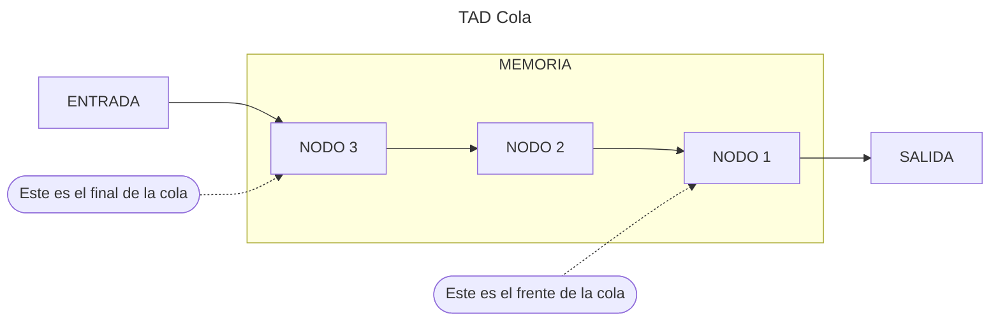
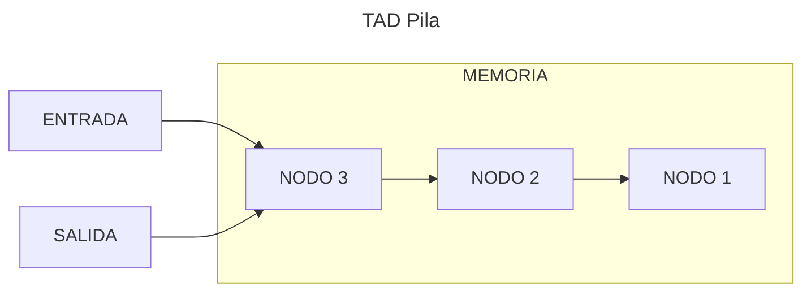
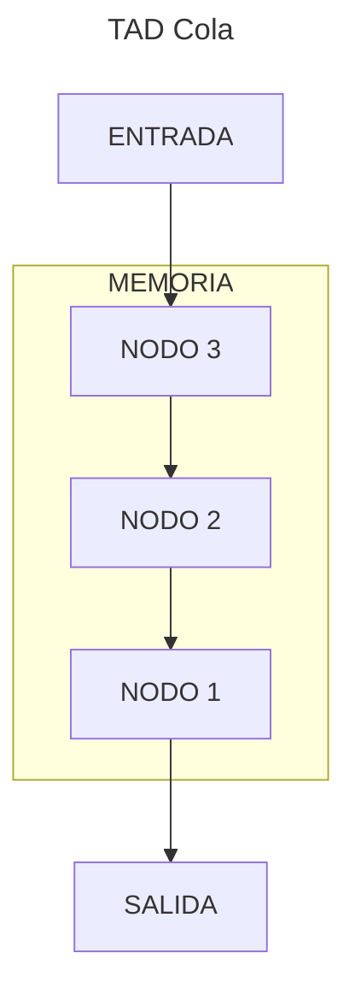
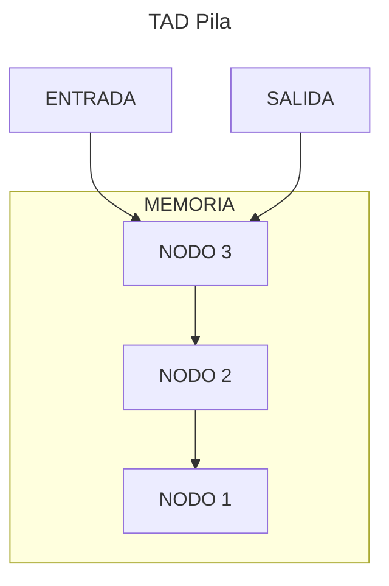

import Mermaid from "@components/Mermaid.astro";
import { ShowcaseProfile } from 'starlight-showcases';

> El TAD Cola y el TAD Pila, especificación informal, implementación y descripción gráfica. Diferencias entre ambos explicadas. Implementaciones con array circular, lista dinámica circular y a partir del TAD Lista. Operaciones explicadas de forma gráfica.

:::note
Para ver las diferencias entre los dos TADs: [TAD Cola vs TAD Pila](#tad-cola-vs-tad-pila)
:::

## TAD Colas

Una cola es una secuencia de cero o más elementos del mismo tipo. Los elementos de una cola están ordenados de una forma
lineal, no por su contenido, sino por la posición que ocupan.

Cuando un elemento es insertado se añade al principio de la cola. Para eliminar o extraer un elemento, solo se podrá
eliminar el primero, que fue el primero en ser insertado. Este concepto es descrito como **FIFO** (First in, first out).

:::note
Para saber más sobre FIFO: [Wikipedia](https://es.wikipedia.org/wiki/First_in,_first_out)
:::

<Mermaid>

</Mermaid>

El **primero en llegar a una cola**, es el **primero en salir de la cola**, ya que está al principio (_front_) de la
cola.

El **último en llegar**, por otra parte, debe preguntar: _¿Dónde está el final de la cola?_ Y esperar pacientemente, ya
que será **el último en salir de la cola**.


### Operaciones

Siguiendo los pasos para la especificación de un TAD, definimos las operaciones del mismo clasificándolas en:
constructoras, generadoras, modificadoras, observadoras y destructoras.

:::note
Para más información: [Tema 1 - Especificación de un TAD](/prodos/apuntes/t1-tipos-abstractos-de-datos-tad/#especificación-de-un-tad)
:::

#### Generadoras

**createEmptyQueue → Queue**

```tex
createEmptyQueue \rightarrow Queue
```

- **Objetivo:** Crea una cola vacía
- **Salida:** Una cola vacía
- **PosCondición:** La cola sin datos

<details>
<summary>Mostrar implementación</summary>

```c title="createEmptyQueue.c"
// SPDX-FileCopyrightText: 2023 Fernando Álvarez
//
// SPDX-License-Identifier: GPL-3.0-only

void createEmptyQueue(tQueue *cola){

    cola->front = QNULL;
    cola->rear = QNULL;

}
```
</details>

**enqueue(Item, Queue) → Queue, bool**

```tex
enqueue (Item, Queue) \rightarrow Queue, bool
```

- **Objetivo:** Inserta un elemento en la cola quedando al final.
- **Entrada:**
  - `Item`: Contenido del elemento a insertar.
  - `Queue`: Cola donde vamos a insertar.
- **Salida:** `Queue`: Cola con el elemento Item insertado y verdadero si se ha podido insertar, falso en caso contrario.

<details>
<summary>Mostrar implementación</summary>

```c title="enqueue.c"
// SPDX-FileCopyrightText: 2023 Fernando Álvarez
//
// SPDX-License-Identifier: GPL-3.0-only

bool enqueue(tItemQ item,tQueue *cola){

    tPosQ aux;

    if(!createNode(&aux)){

        return false;
    }
    else{

        aux->data=item;
        aux->next=QNULL;

        if(cola->front == QNULL){
            cola->front = aux;

        }
        else{
            cola->rear->next = aux;
        }
        cola->rear = aux;

        return true;
    }

}
```
</details>

#### Destructoras

**dequeue(Queue) → Queue**

```tex
dequeue(Queue) \rightarrow Queue
```

- **Objetivo:** Elimina el primer elemento de la cola
- **Entrada:** `Queue`: Cola a modificar
- **Salida:** `Queue`: Cola sin el primer elemento
- **Precondición:** La cola no está vacía

<details>
<summary>Mostrar implementación</summary>

```c title="dequeue.c"
// SPDX-FileCopyrightText: 2023 Fernando Álvarez
//
// SPDX-License-Identifier: GPL-3.0-only

void dequeue(tQueue *cola){

    tPosQ aux;
    aux = cola->front;
    cola->front = aux->next;
    if(cola->front == QNULL){

        cola->rear = QNULL;
    }
    free(aux);

}
```
</details>

#### Observadoras

**front(Queue) → Item**

```tex
front(Queue) \rightarrow Item
```

- **Objetivo:** Recupera el contenido del primer elemento de la cola
- **Entrada:** `Queue`: Cola donde obtener el dato
- **Salida:** `Item`: Contenido del primer elemento de la cola
- **Precondición:** La cola no está vacía

<details>
<summary>Mostrar implementación</summary>

```c title="front.c"
// SPDX-FileCopyrightText: 2023 Fernando Álvarez
//
// SPDX-License-Identifier: GPL-3.0-only

tItemQ front(tQueue cola){

    return cola.front->data;
}
```
</details>

**isEmptyQueue(Queue) → bool**

```tex
isEmptyQueue(Queue) \rightarrow bool
```

- **Objetivo:** Determina si la cola está vacía
- **Entrada:** `Queue`: Cola a comprobar
- **Salida:** Verdadero si la cola está vacía, falso en caso contrario

<details>
<summary>Mostrar implementación</summary>

```c title="isEmptyQueue.c"
// SPDX-FileCopyrightText: 2023 Fernando Álvarez
//
// SPDX-License-Identifier: GPL-3.0-only

bool isEmptyQueue(tQueue cola){

    return(cola.front == QNULL);

}
```
</details>

## Implementación con array circular

:::caution[Work in Progress]
Sección en desarrollo
:::

## Implementación con lista dinámica circular

:::caution[Work in Progress]
Sección en desarrollo
:::

## Implementación a partir del TAD Lista

:::caution[Work in Progress]
Sección en desarrollo
:::

:::note
Esta implementación se basa en el [Tema 3 - Listas](/prodos/apuntes/t3-listas/).
:::

## TAD Pilas

Una pila es una secuencia de cero o más elementos del mismo tipo. Los elementos de una cola están ordenados de una forma
lineal, no por su contenido, sino por la posición que ocupan.

Cuando un elemento es insertado se añade al principio de la pila. Para extraer o eliminar un elemento solo se puede el
primer elemento, que fue último en añadirse. Este concepto es descrito como **LIFO** (Last in, first out).

:::note
Para saber más sobre LIFO: [Wikipedia](https://es.wikipedia.org/wiki/Last_in,_first_out)
:::

<Mermaid>

</Mermaid>

Cuando agregas libros a una pila, el **primer libro** queda _aplastado_ bajo el peso de todos los demás. **Al fondo de
la pila**.

El **último libro** es el de la **cima** (_peek_) y es el que primero puedes retirar.

Para poder retirar el libro que **primero** se depositó en la pila debes **retirar todos antes**.


### Operaciones

Siguiendo los pasos para la especificación de un TAD, definimos las operaciones del mismo clasificándolas en:
constructoras, generadoras, modificadoras, observadoras y destructoras.

:::note
Para más información: [Tema 1 - Especificación de un TAD](/prodos/apuntes/t1-tipos-abstractos-de-datos-tad/#especificación-de-un-tad)
:::

#### Generadoras

**createEmptyStack → Stack**

```tex
createEmptyStack \rightarrow Stack
```

- **Objetivo:** Crea una pila vacía
- **Salida:** Una pila vacía
- **PosCondición:** La pila sin datos

<details>
<summary>Mostrar implementación</summary>

```c title="createEmptyStack.c"
// EN CONSTRUCCIÓN
// COLABORA https://github.com/TeenBiscuits/Pasame-Codigo
```
</details>

**push(Item, Stack) → Stack, bool**

```tex
push (Item, Stack) \rightarrow Stack, bool
```

- **Objetivo:** Inserta un elemento en la cola quedando al final.
- **Entrada:**
  - `Item`: Contenido del elemento a insertar.
  - `Queue`: Cola donde vamos a insertar.
- **Salida:** `Stack`: Cola con el elemento Item insertado y verdadero si se ha podido insertar, falso en caso contrario.

<details>
<summary>Mostrar implementación</summary>

```c title="push.c"
// EN CONSTRUCCIÓN
// COLABORA https://github.com/TeenBiscuits/Pasame-Codigo
```
</details>

#### Destructoras

**pop(Stack) → Stack**

```tex
pop(Stack) \rightarrow Stack
```

- **Objetivo:** Saca el elemento de la cima de la pila
- **Entrada:** `Stack`: Pila de donde vamos a sacar
- **Salida:** `Stack`: Pila sin el elemento de su cima
- **Precondición:** La pila no está vacía

<details>
<summary>Mostrar implementación</summary>

```c title="pop.c"
// EN CONSTRUCCIÓN
// COLABORA https://github.com/TeenBiscuits/Pasame-Codigo
```
</details>

#### Observadoras

**peek(Stack) → Item**

```tex
peek(Stack) \rightarrow Item
```

- **Objetivo:** Recupera el contenido del elemento de la cima de la pila
- **Entrada:** `Stack`: Pila donde obtener el dato
- **Salida:** `Item`: Contenido del elemento de la cima de la pila
- **Precondición:** La pila no está vacía

<details>
<summary>Mostrar implementación</summary>

```c title="peek.c"
// EN CONSTRUCCIÓN
// COLABORA https://github.com/TeenBiscuits/Pasame-Codigo
```
</details>

**isEmptyStack(Stack) → bool**

```tex
isEmptyStack(Stack) \rightarrow bool
```

- **Objetivo:** Determina si una pila está vacía
- **Entrada:** `Stack`: Pila a comprobar
- **Salida:** Verdadero si la pila está vacía, falso en caso contrario

<details>
<summary>Mostrar implementación</summary>

```c title="isEmptyStack.c"
// EN CONSTRUCCIÓN
// COLABORA https://github.com/TeenBiscuits/Pasame-Codigo
```
</details>

## TAD Cola vs TAD Pila

El TAD Cola y el TAD Pila son muy similares, por eso en estos apuntes han sido unificados en un solo tema.

| TAD Cola (Queue) | TAD Pila (Stack) |
|------------------|------------------|
| El primero en entrar, el primero en salir (FIFO) | El último en entrar, el primero en salir (LIFO) |
| `createEmptyQueue()` | `createEmptyStack()` |
| `isEmptyQueue(Queue)` | `isEmptyStack(Stack)` |
| `enqueue(Item, Queue)` y `dequeue(Queue)`: Añadir y Eliminar un elemento a la cola | `push(Item, Stack)` y `pop(Stack)`: Añadir y Eliminar un elemento a la pila |
| `front(Queue)`: Devuelve el elemento `n` de la cola (el primero en entrar). | `peek(Stack)`: Devuelve el elemento `0` de la pila (el último en entrar). |

<Mermaid>

</Mermaid>

<Mermaid>

</Mermaid>

<ShowcaseProfile
  entries={[
      {
      name: 'Fernando Álvarez',
      picture: 'https://avatars.githubusercontent.com/u/114153352?v=4',
      href: 'https://github.com/FerLS',
      description:
        "Código - © 2023",
    },
    {
      name: 'Pablo Portas López',
      picture: 'https://avatars.githubusercontent.com/u/81629707?v=4',
      href: 'https://github.com/TeenBiscuits',
      description:
        "© 2024 licensed under CC BY-NC 4.0",
    },
  ]}
/>
