import Mermaid from "@components/Mermaid.astro";
import { ShowcaseProfile } from 'starlight-showcases';

> El TAD Árbol Binario, definiciones, especificación informal, implementación y descripción gráfica. Operaciones explicadas de forma gráfica e implementadas. Recorridos en profundidad (preorden, inorden y posorden) y recorrido en anchura.

## ¿Qué es un árbol?

<Mermaid>
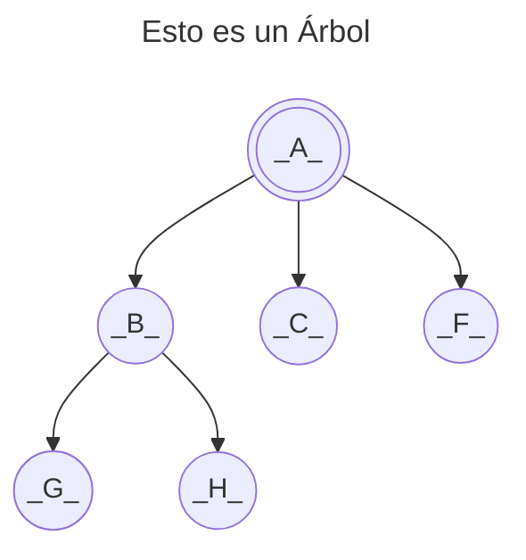
</Mermaid>

Definido por:

- Una raíz: `A`, padre de `B`, `C` y `F`.
- `G` hermanos `H`, hijos de `B` y descendientes de `A`.
- Altura del árbol: `3`
- Grado del árbol: `3` (Nº de hijos máximo, alcanzado por `A`)

:::note
Para más sobre árboles en la informática: [Wikipedia](https://es.wikipedia.org/wiki/Arbol_(informatica))
:::

Para trabajar con **Árboles Binarios** es importante tener claro el concepto de **árbol lleno** y **árbol completo**.

| Árbol Lleno | Árbol Completo |
|-------------|----------------|
| **Todas sus hojas están al mismo nivel** `h` y todos los nodos anteriores tienen el **número máximo de hijos** (en un árbol binario, 2). | **Todas sus hojas llenas hasta** `h-1` y **todos los nodos del nivel** `h` están lo más a la **izquierda** posible. |

**Árbol Lleno:**

<Mermaid>
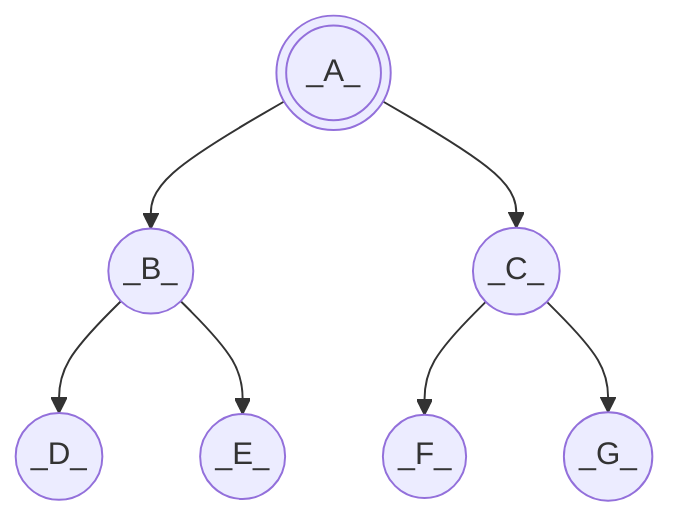
</Mermaid>

**Árbol Completo:**

<Mermaid>
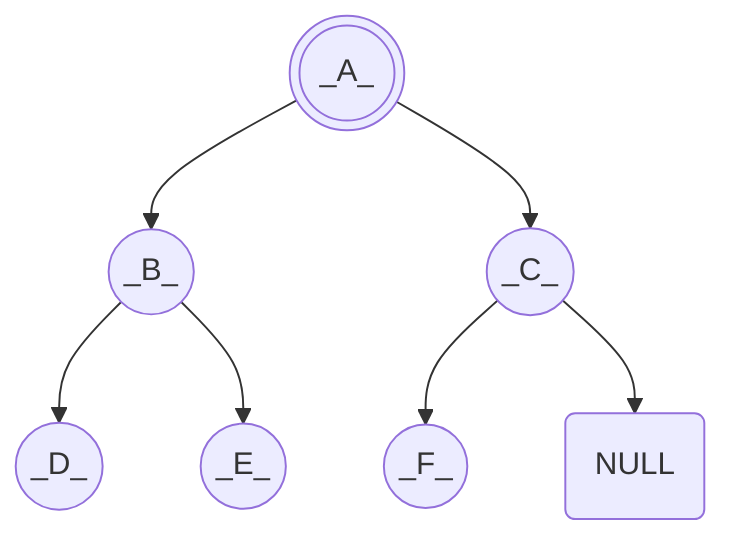
</Mermaid>

## TAD Árbol Binario

Un árbol binario es un conjunto cero o más de elementos del mismo tipo llamados nodos.

- O bien 0 nodos, en cuyo caso: **árbol vacío**
- O bien existe un elemento distinguido **llamado raíz**, y el resto de los nodos se distribuyen en dos subconjuntos, y
  a su vez cada nodo tiene una serie de **hasta dos hijos** los cuales solo pueden tener **hasta dos hijos**. Formando así
  los subconjuntos siguientes.

<Mermaid>
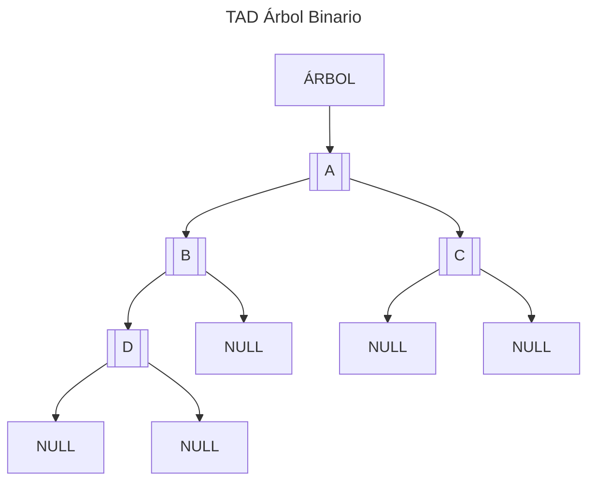
</Mermaid>

### Operaciones

Siguiendo los pasos para la especificación de un TAD, definimos las operaciones del mismo clasificándolas en:
constructoras, generadoras, modificadoras, observadoras y destructoras.

:::note
Para más información: [Tema 1 - Especificación de un TAD](/prodos/apuntes/t1-tipos-abstractos-de-datos-tad/#especificación-de-un-tad)
:::

#### Generadoras

**createEmptyTree → Tree**

```tex
createEmptyTree \rightarrow Tree
```

- **Objetivo:** Crea un árbol vacío
- **Salida:** Un árbol vacío
- **PosCondición:** El árbol sin datos

<Mermaid>
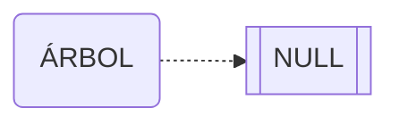
</Mermaid>

<details>
<summary>Mostrar implementación</summary>

```c title="createEmptyTree.c"
// SPDX-FileCopyrightText: 2023 Fernando Álvarez
//
// SPDX-License-Identifier: GPL-3.0-only

void createEmptyTree(tBinTree *T){

    *T = TNULL;

}
```
</details>

**BuildTree(Tree, Item, Tree) → Tree, bool**

```tex
BuildTree (Tree, Item, Tree) \rightarrow Tree, bool
```

- **Objetivo:** Crea un árbol con cierta información en la raíz y como hijos los árboles que se reciben en las entradas.
- **Entrada:**
  - `Tree(1)`: Árbol que constituirá el hijo izquierdo.
  - `Item`: Contenido del elemento raíz.
  - `Tree(2)`: Árbol que constituirá el hijo derecho.
- **Salida:** `Tree`: Nuevo árbol construido y verdadero si se ha podido construir, falso en caso contrario.

<Mermaid>
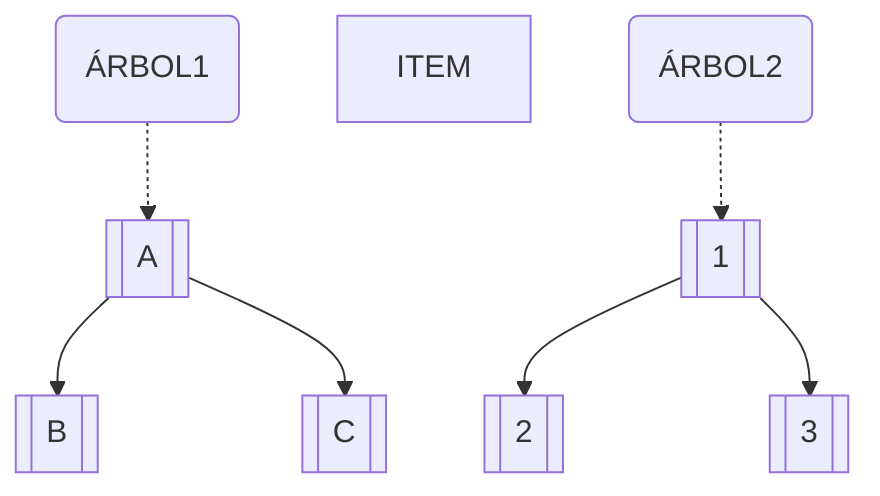
</Mermaid>

<Mermaid>
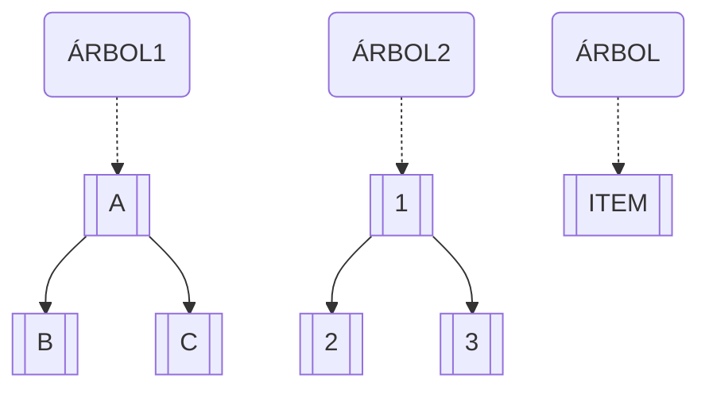
</Mermaid>

<Mermaid>
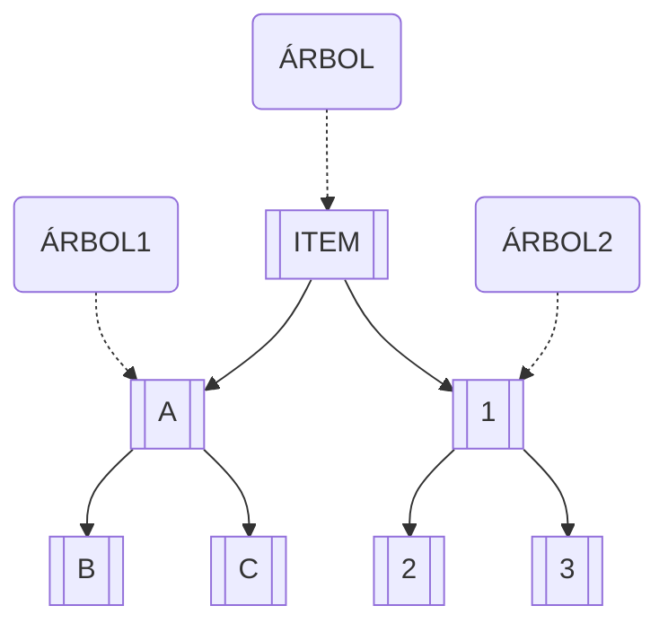
</Mermaid>

<details>
<summary>Mostrar implementación</summary>

```c title="buildTree.c"
// SPDX-FileCopyrightText: 2023 Fernando Álvarez
//
// SPDX-License-Identifier: GPL-3.0-only

bool BuildTree(tBinTree LT,tItemT itemT,tBinTree RT,tBinTree *T){

    if(createNode(T)){

        (*T)->data=itemT;
        (*T)->left=LT;
        (*T)->right=RT;
        return true;
    }
    else return false;


}
```
</details>

#### Observadoras

**leftChild(Tree) → Tree**

```tex
leftChild(Tree) \rightarrow Tree
```

- **Objetivo:** Devuelve el árbol que constituye el hijo izquierdo del árbol
- **Entrada:** `Tree`: Árbol a manipular
- **Salida:** `Tree`: Árbol que constituye el hijo izquierdo o nulo del árbol
- **Precondición:** El árbol no está vacío

<Mermaid>
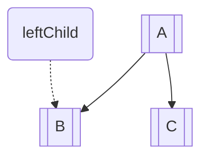
</Mermaid>

<details>
<summary>Mostrar implementación</summary>

```c title="leftChild.c"
// SPDX-FileCopyrightText: 2023 Fernando Álvarez
//
// SPDX-License-Identifier: GPL-3.0-only

tBinTree LeftChild(tBinTree T){

    return T->left;

}
```
</details>

**rightChild(Tree) → Tree**

```tex
rightChild(Tree) \rightarrow Tree
```

- **Objetivo:** Devuelve el árbol que constituye el hijo derecho del árbol
- **Entrada:** `Tree`: Árbol a manipular
- **Salida:** `Tree`: Árbol que constituye el hijo derecho o nulo del árbol
- **Precondición:** El árbol no está vacío

<Mermaid>
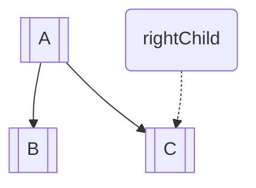
</Mermaid>

<details>
<summary>Mostrar implementación</summary>

```c title="rightChild.c"
// SPDX-FileCopyrightText: 2023 Fernando Álvarez
//
// SPDX-License-Identifier: GPL-3.0-only

tBinTree RightChild(tBinTree T){

    return T->right;ç

}
```
</details>

**root(Tree) → Item**

```tex
root(Tree) \rightarrow Item
```

- **Objetivo:** Devuelve el dato de la raíz del árbol
- **Entrada:** `Tree`: Árbol a manipular
- **Salida:** `Item`: Contenido del elemento de la raíz
- **PreCondición:** El árbol no está vacío

<Mermaid>
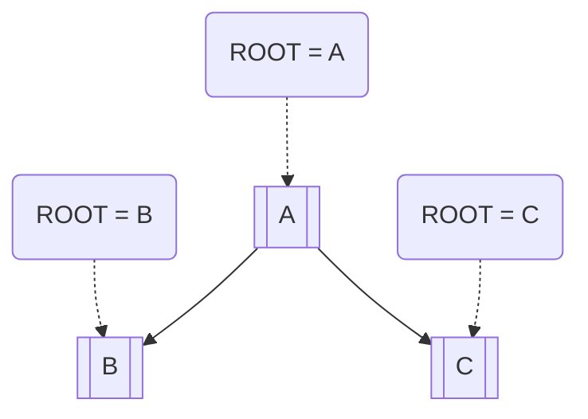
</Mermaid>

<details>
<summary>Mostrar implementación</summary>

```c title="root.c"
// SPDX-FileCopyrightText: 2023 Fernando Álvarez
//
// SPDX-License-Identifier: GPL-3.0-only

tItemT Root(tBinTree T){

    return  T->data;

}
```
</details>

**isEmptyTree(Tree) → bool**

```tex
isEmptyTree(Tree) \rightarrow bool
```

- **Objetivo:** Determina si el árbol está vacío
- **Entrada:** `Tree`: Árbol a manipular
- **Salida:** Verdadero si el árbol está vacío, falso en caso contrario

<Mermaid>
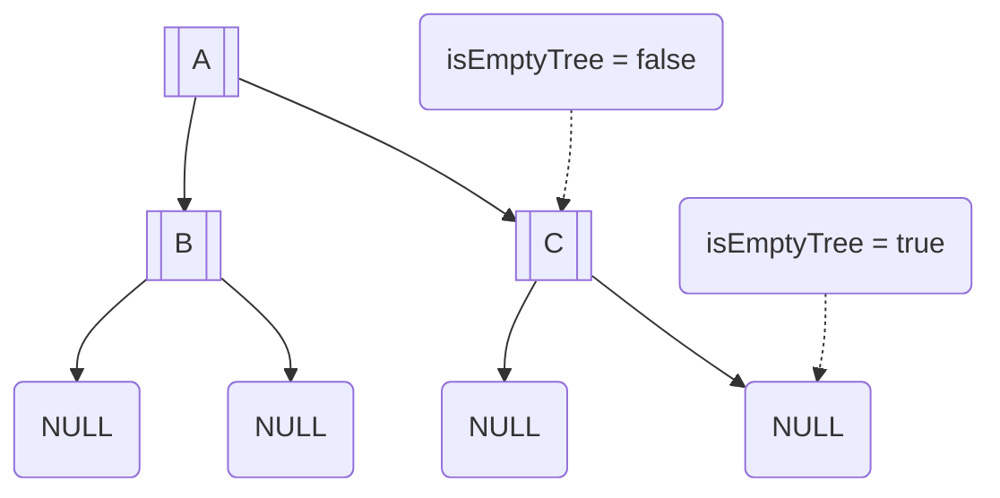
</Mermaid>

<details>
<summary>Mostrar implementación</summary>

```c title="isEmptyTree.c"
// SPDX-FileCopyrightText: 2023 Fernando Álvarez
//
// SPDX-License-Identifier: GPL-3.0-only

bool isEmptyTree(tBinTree T){

    return (T==TNULL);

}
```
</details>

## Recorridos de Árboles

:::note
Esta es la manera sistemática de recorrer un árbol.
:::

<Mermaid>
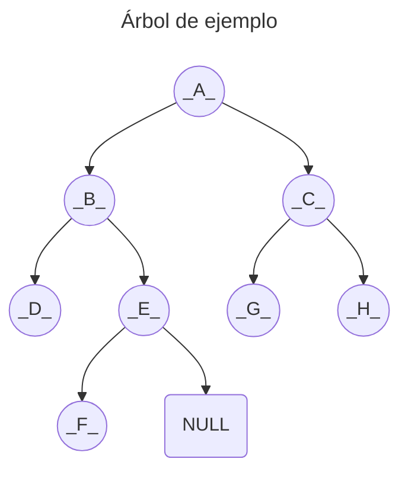
</Mermaid>

### Recorridos en profundidad

Vídeo explicativo de los recorridos en profundidad.

:::tip
Vídeo realizado por David Julián Guzmán Cárdenas, estudiante de Ingeniería de Sistemas y Computación de la Universidad Nacional de Colombia
[Link al vídeo](https://youtu.be/95CgVIsOxLA?si=xT7m6D4k92DadqFb)
:::

:::note
En los dibujos no ha sido representado la totalidad del recorrido, solo una idea general del movimiento.
:::

#### Preorden (R | ID)

- (R) Raíz
- (I) Izquierdo
- (D) Derecho

<Mermaid>
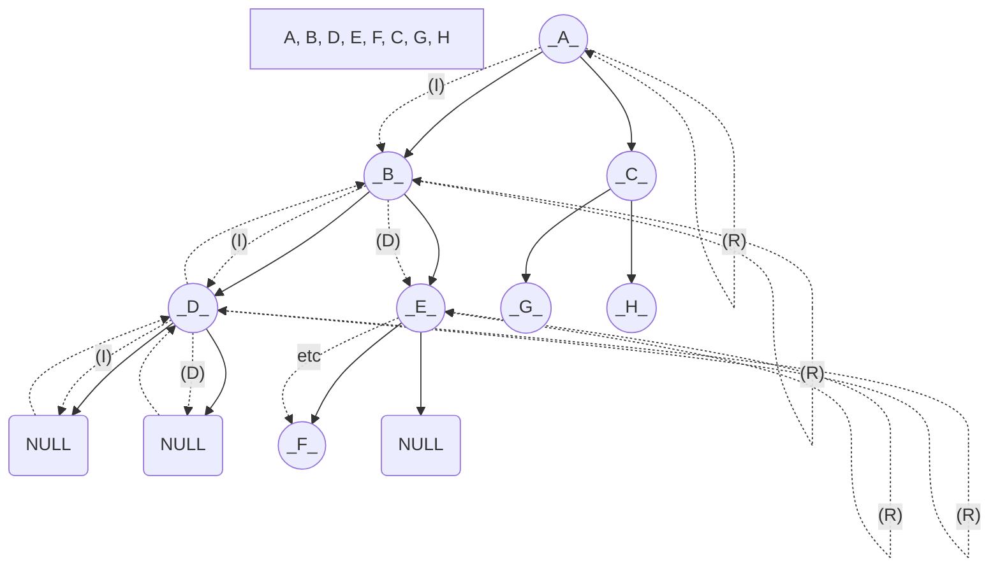
</Mermaid>

#### Inorden (I | R | D)

- (I) Izquierdo
- (R) Raíz
- (D) Derecho

<Mermaid>
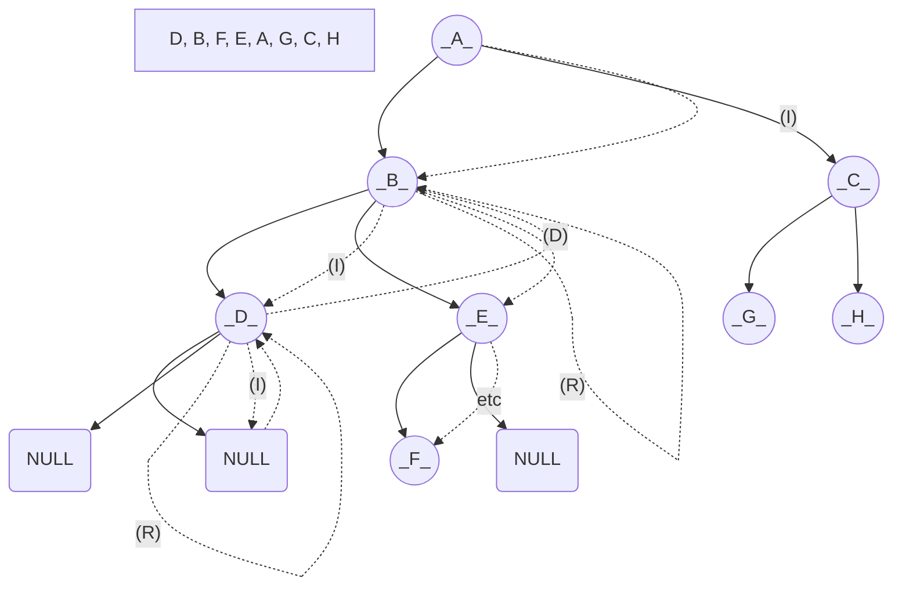
</Mermaid>

#### Posorden (ID | R)

- (I) Izquierdo
- (D) Derecho
- (R) Raíz

<Mermaid>
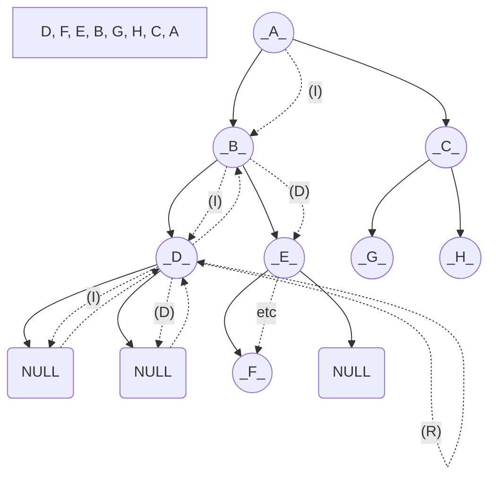
</Mermaid>

### Recorrido en anchura

<Mermaid>
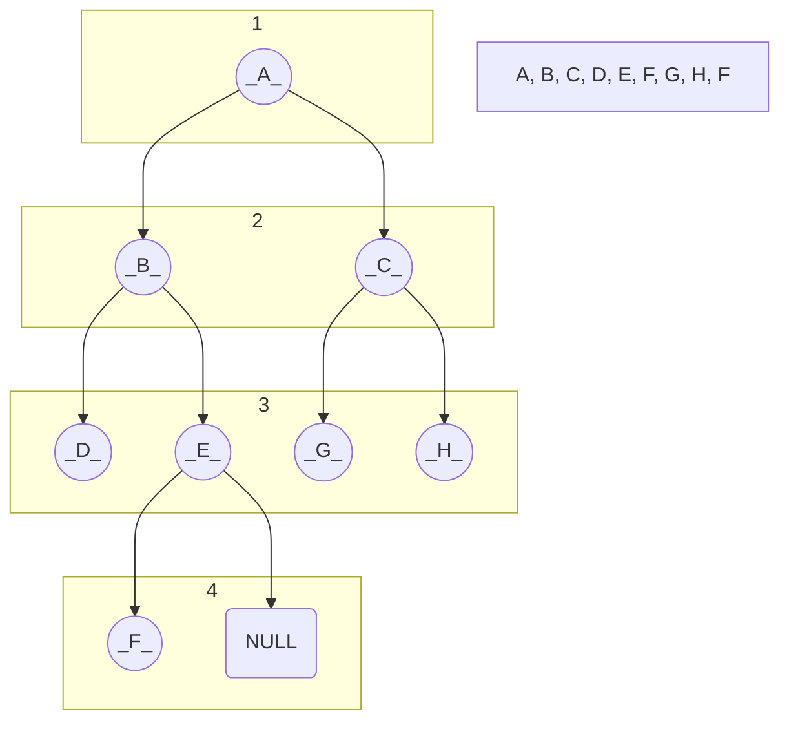
</Mermaid>

<ShowcaseProfile
  entries={[
    {
      name: 'Fernando Álvarez',
      picture: 'https://avatars.githubusercontent.com/u/114153352?v=4',
      href: 'https://github.com/FerLS',
      description:
        "Código - © 2023",
    },
    {
      name: 'Pablo Portas López',
      picture: 'https://avatars.githubusercontent.com/u/81629707?v=4',
      href: 'https://github.com/TeenBiscuits',
      description:
        "© 2024 licensed under CC BY-NC 4.0",
    },
  ]}
/>
