import { ShowcaseProfile } from 'starlight-showcases';

> El TAD Árbol Binario de Búsqueda ABB y el TAD Árbol Binario de Búsqueda AVL, especificación informal, implementación y descripción gráfica. Operaciones explicadas de forma gráfica e implementadas. Rotaciones (LL, RR, LR y RL) y factor de equilibrio.

## TAD Árbol Binario de Búsqueda ABB

### Definición

- Es un árbol binario.
- Tiene asociada una clave de ordenación _k_.
- Cumple para cualquier nodo _T_ del árbol:
    - los valores de los nodos del subárbol **izquierdo** de _T_ son **menores** que el valor de _T_.
    - los valores de los nodos del subárbol **derecho** son _T_ mayores que el valor de _T_.

- **Mayor eficiencia** frente a...
    - estructuras **estáticas** en operaciones de **inserción** y **eliminación**.
    - estructuras **dinámicas** en la operación de **búsqueda**.

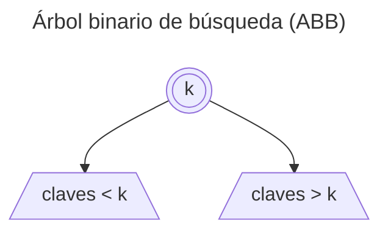

### Pros y contras

**Eficiencia del proceso de búsqueda en árboles equilibrados**

Si los nodos se añaden en un orden aleatorio habrá que equilibrarlo:

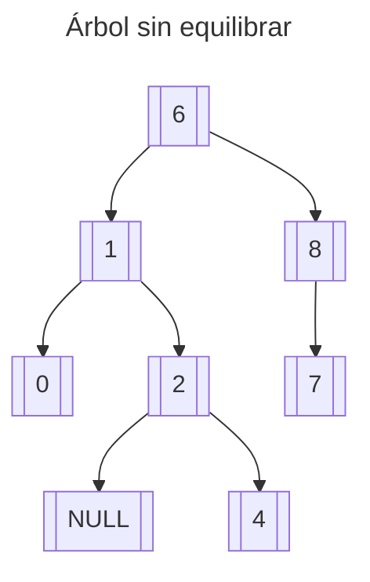

Si los nodos se añaden en un orden determinado el árbol degenerará en una lista ordenada:

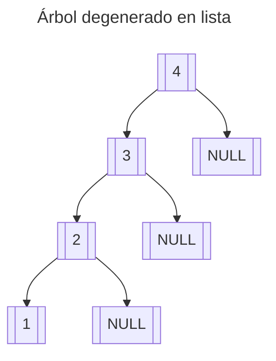

### Operaciones

Basándonos en el [TAD Árbol](/prodos/apuntes/t6-arboles/#operaciones) definimos las operaciones del árbol de búsqueda a cambiar.

:::note
Para más información: [TAD Árbol](/prodos/apuntes/t6-arboles/#tad-árbol-binario) y [Tema 1 - Especificación de un TAD](/prodos/apuntes/t1-tipos-abstractos-de-datos-tad/#especificación-de-un-tad)
:::

#### Generadoras

**createEmptyTree → Tree**

```tex
createEmptyTree \rightarrow Tree
```

**insertKey(Tree, Key) → Tree, bool**

```tex
insertKey(Tree, Key) \rightarrow Tree, bool
```

- **Objetivo:** Insertar un nodo con información en el árbol, en su lugar correspondiente, de acuerdo al valor de una clave
- **Entrada:**
  - `Tree`: Árbol a modificar
  - `Key`: Dato a insertar
- **Salida:** `Tree`: Nuevo árbol que resulta de la inserción y verdadero si se ha podido insertar o si la clave existe, falso en caso contrario.
- **Poscondición:** El árbol incorpora un nuevo nodo con los datos si éstos no existían en el árbol

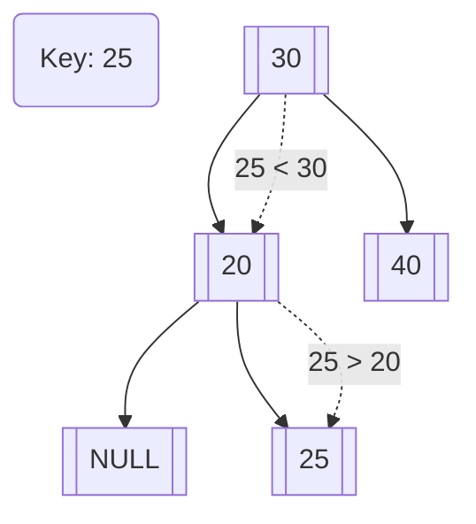

<details>
<summary>Mostrar implementación</summary>

```c title="insertKey.c"
// EN CONSTRUCCIÓN
// COLABORA https://github.com/TeenBiscuits/Pasame-Codigo
```
</details>

#### Observadoras

**leftChild(Tree) → Tree**

```tex
leftChild(Tree) \rightarrow Tree
```

**rightChild(Tree) → Tree**

```tex
rightChild(Tree) \rightarrow Tree
```

**root(Tree) → Item**

```tex
root(Tree) \rightarrow Item
```

**isEmptyTree(Tree) → bool**

```tex
isEmptyTree(Tree) \rightarrow bool
```

**findKey(Key, Tree) → Tree**

```tex
findKey(Key, Tree) \rightarrow Tree
```

- **Objetivo:** Devuelve el subárbol cuya raíz contiene la clave
- **Entrada:**
  - `Key`: Dato a buscar
  - `Tree`: Árbol a manipular
- **Salida:** `Tree`: Acceso al árbol cuya raíz contiene la clave, o nulo si éste no existe (el árbol está vacío o no contiene esa clave)

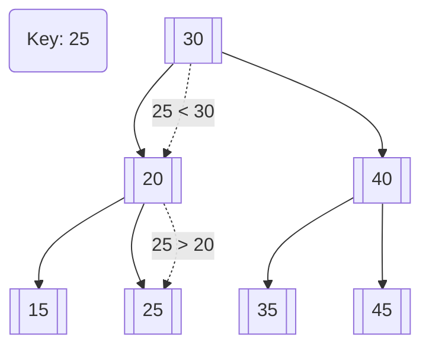

<details>
<summary>Mostrar implementación</summary>

```c title="findKey.c"
// EN CONSTRUCCIÓN
// COLABORA https://github.com/TeenBiscuits/Pasame-Codigo
```
</details>

#### Destructoras

**removeKey(Key, Tree) → Tree**

```tex
removeKey(Key, Tree) \rightarrow Tree
```

- **Objetivo:** Eliminar el nodo cuyo contenido coincide con la clave
- **Entrada:**
  - `Key`: Clave del nodo a eliminar
  - `Tree`: Árbol a modificar
- **Salida:** `Tree`: Nuevo árbol sin el nodo eliminado
- **Precondición:** La clave existe en el árbol

:::note
Se deben tener en cuenta los hijos del nodo a borrar, ya que deben continuar en el árbol. Si el nodo tienen dos hijos, se sustituye por el mayor de los hijos menores (subárbol izquierdo).
:::

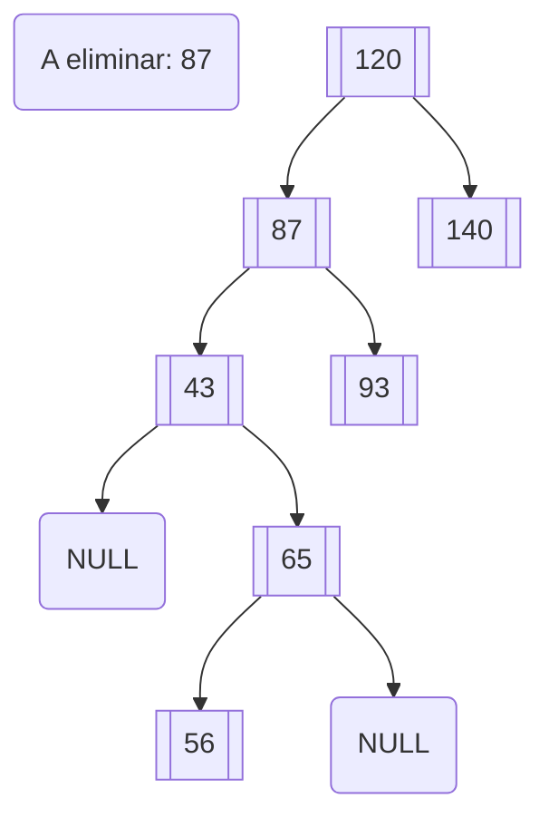

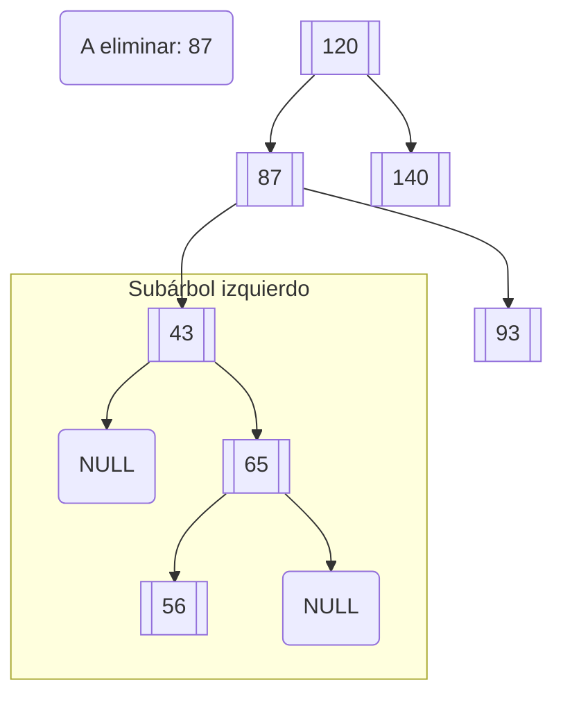

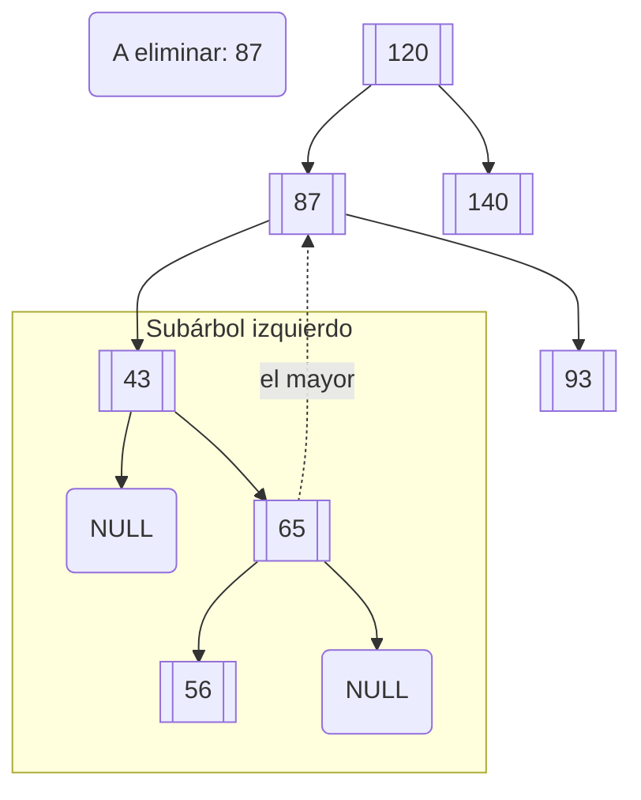

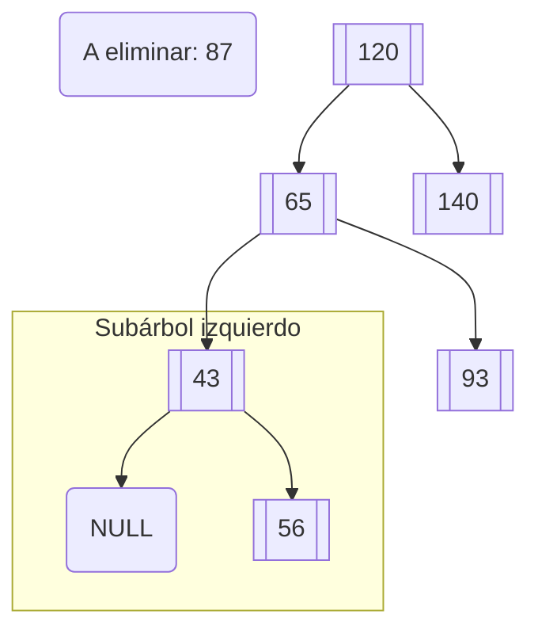

<details>
<summary>Mostrar implementación</summary>

```c title="removeKey.c"
// EN CONSTRUCCIÓN
// COLABORA https://github.com/TeenBiscuits/Pasame-Codigo
```
</details>

## Árboles Binarios de Búsqueda Equilibrados (AVL)

Un árbol binario de búsqueda equilibrado es un árbol de búsqueda (_redundante ya lo sé_) en el que, para cada
nodo, se cumple que la diferencia de altura de sus subárboles **nunca es mayor que uno** (las diferencias son en valor
absoluto, intervalo [-1, 1]).

Estos árboles hacen búsquedas **muy eficientes**, ya que mantienen **una altura mínima** evitando así los [**árboles
degenerados**](#pros-y-contras).

El **factor de equilibrio** (balance factor) de un nodo se define como la **altura de su subárbol derecho** menos
**altura de su subárbol izquierdo**. Para ser un AVL debes tener un **factor de equilibrio en cada nodo entre [-1, 1]**.

```tex
bf(N) = hNDch - hNIzq
```

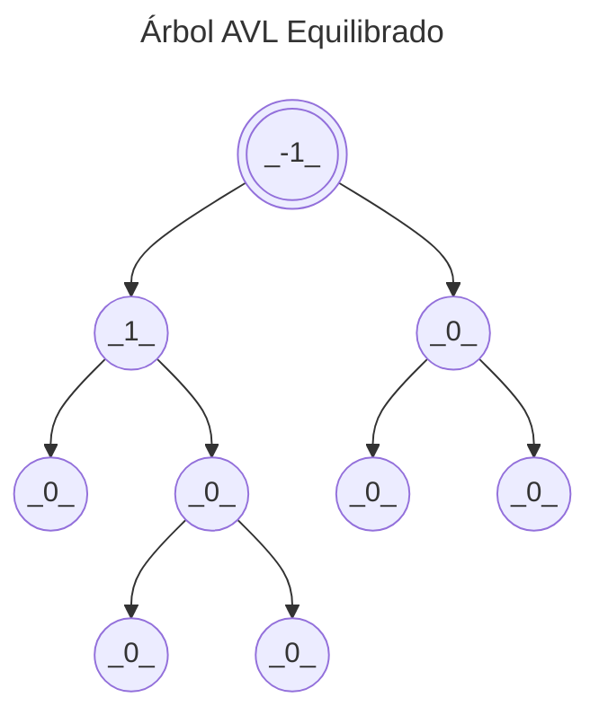

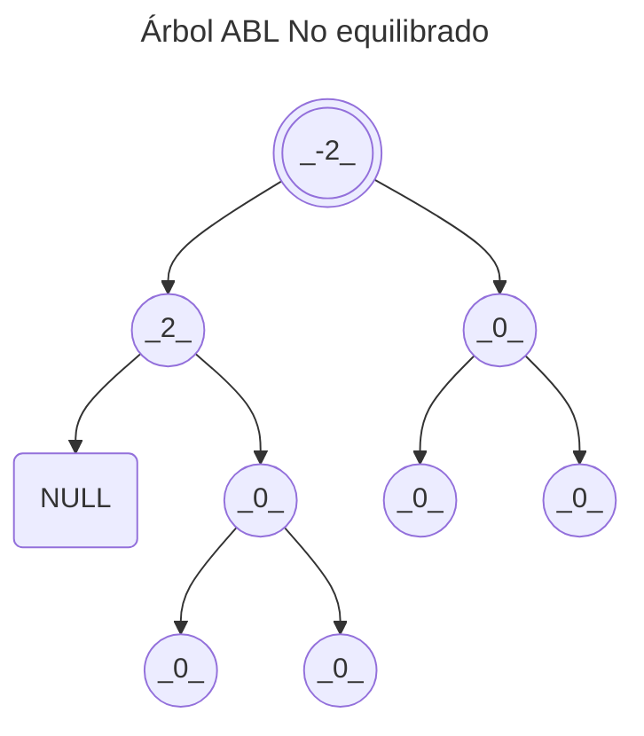

:::note
Se denominan AVL en honor a Adelson, Velskii y Landis, que fueron los primeros en proponer este TAD. [Wikipedia](https://es.wikipedia.org/wiki/Árbol_AVL)
:::

### Operaciones

Respecto a la [especificación del árbol binario de búsqueda ABB](#abb-operaciones) solo cambian las funciones de
inserción y borrados, que también deben **mantener equilibrado el árbol**.

Si el árbol está en perfecto equilibrio una inserción o un borrado no romperá el equilibrio. De no estarlo, una
inserción o un borrado podría romper el equilibrio.


Para solucionar esto debemos emplear [rotaciones para restaurar el equilibrio](#rotaciones-para-restaurar-el-equilibrio).

### Rotaciones para restaurar el equilibrio

:::caution[Work in Progress]
Sección en desarrollo
:::

- **Rotaciones simples**
    - Son aquellas que involucran a dos nodos.
    - La rotación left-left (LL) y la rotación right-right (RR).
- **Rotaciones complejas**
    - Son aquellas que involucran a tres nodos.
    - Tenemos la rotación right-left (RL) y la rotación left-right (LR).

<ShowcaseProfile
  entries={[
    {
      name: 'Pablo Portas López',
      picture: 'https://avatars.githubusercontent.com/u/81629707?v=4',
      href: 'https://github.com/TeenBiscuits',
      description:
        "© 2024 licensed under CC BY-NC 4.0",
    },
  ]}
/>
